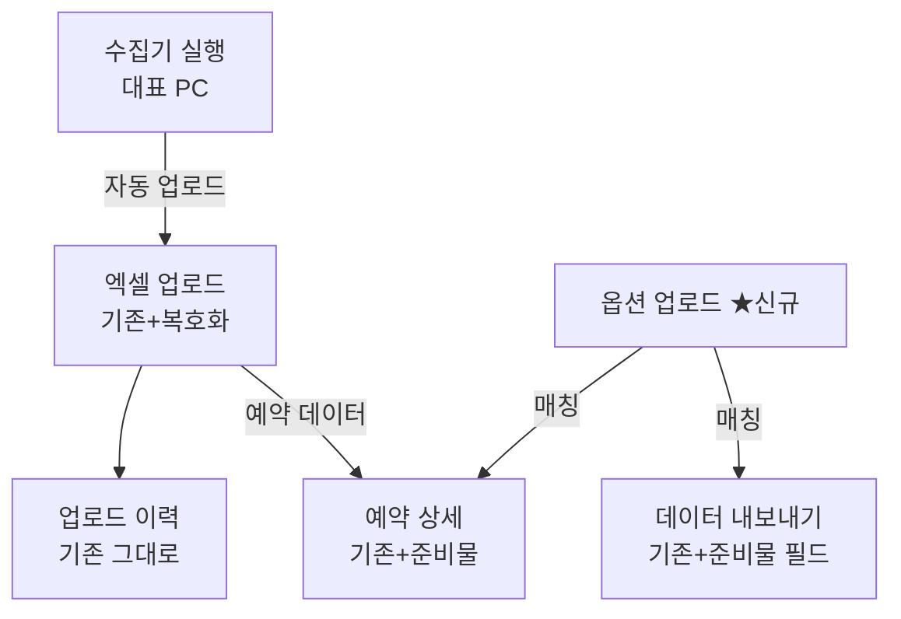
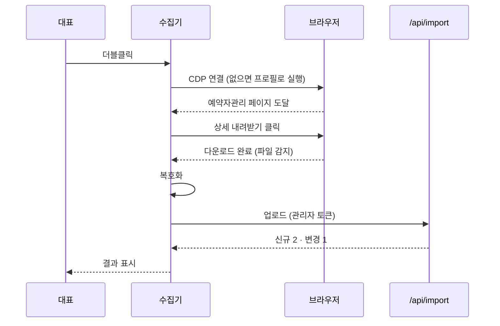
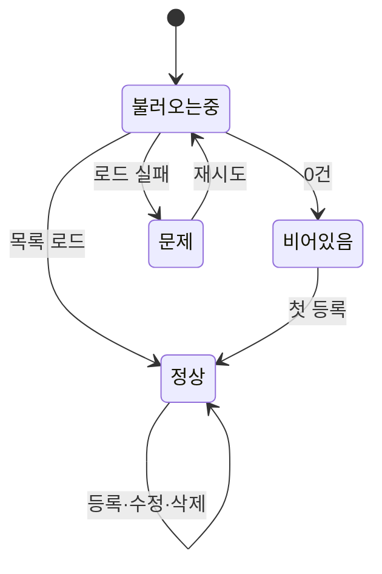

# 고마워할매 대시보드 추가기능 FRD (증분)

> 작성일: 2026-07-17 · 버전: v1.0
> PRD: `prd-gomawohalme-addon-20260717.md` v1.0 (+핸드오프)
> 기준: v2 FRD (`frd-gomawohalme-reservation-dashboard-v2-20260709.md`) — 본 문서는 증분이며 기존 화면 정의를 덮어쓰지 않는다
> 다음 단계: TRD (`frd-gomawohalme-addon-20260717-handoff.md` 참조)

---

## 1. 한 문단 요약

이 FRD가 다루는 것은 신규 화면 1개(옵션 업로드), 기존 화면 확장 3개(엑셀 업로드·예약 상세·데이터 내보내기), 그리고 웹 화면이 아닌 수집기 프로그램 1개다. 핵심은 두 개로 압축된다. 하나는 "수집기 파이프라인"(브라우저 연결→상세 내려받기 클릭→복호화→업로드)이고, 다른 하나는 "옵션 업로드 화면"(준비물 등록과 매칭)이다. 이 둘이 되면 나머지 확장(상세 표시·내보내기 필드)은 매칭 결과를 뿌리는 일에 가깝다.

추정 개발 기간은 1인 3주다. TRD로 넘어가는 큰 결정은 수집기→API 인증 방식과 비밀번호 암호화 방식 2건이고, 미해결 항목은 3건(비밀번호 값·브라우저 확정·다운로드 파일명 패턴)으로 모두 착수 시 실물 확인으로 풀리는 값이다.

---

## 2. 무엇을 만드는가 (화면 지도)

사용자(관리자) 기준으로 두 개의 동선이 생긴다. 데이터 갱신 동선은 수집기에서 시작해 대시보드 업로드 이력에서 끝나고, 준비물 동선은 옵션 업로드 화면에서 등록한 내용이 예약 상세와 내보내기에 나타나는 흐름이다.

### 2.1 전체 화면 흐름



### 2.2 화면 분류 (Tier)

빠지면 이번 증분이 성립하지 않는 것은 수집기 파이프라인과 옵션 업로드 화면이다. 표시·출력 확장은 필수 보조(Tier 1)로 분류한다.

| Tier | 의미 | 대상 | v1 포함 |
|---|---|---|---|
| Core | 빠지면 증분이 성립 안 함 | 수집기 파이프라인, 옵션 업로드 화면 | ✅ |
| Tier 1 | 필수 보조 | 예약 상세 준비물 표시, 내보내기 필드, 비밀번호 설정 카드 | ✅ |
| Tier 2 | v1.x에서 추가 | 미등록 옵션 목록(A-009), 수동 투입 폴백(A-010) | ⚠️ 여유 시 |
| Tier 3 | v2 이후 | 정시 자동 실행, 미등록 옵션 알림 | ❌ |

> 정밀한 화면 ID 카탈로그와 URL은 핸드오프 §1 참조.

---

## 3. MVP 범위 (핵심 2개)

핵심을 수집기와 옵션 업로드 두 개로 잡은 이유: 대표의 실제 고통(업로드 에러·준비물 기억 의존)을 직접 제거하는 것이 이 둘이고, 나머지는 이 둘의 결과를 보여주는 화면이기 때문이다.

### 3.1 핵심 1: 수집기 파이프라인

대표가 아이콘을 더블클릭하면 1~3분 뒤 대시보드 예약 데이터가 최신이 된다. 1초 데모: "더블클릭 → 로그 창에 단계가 흐르고 → '12건 반영 완료'". 이 경험이 성립하려면 다섯 단계(연결→이동→클릭→복호화→업로드)가 각각 실패해도 명확한 다음 행동을 안내해야 한다. 실패 안내가 모호하면 대표는 다시 수동 방식으로 돌아간다.

### 3.2 핵심 2: 옵션 업로드 화면

옵션명과 준비물을 입력하는 단순한 화면이지만, 매칭 규칙(부분 일치·긴 키워드 우선)이 이 화면의 실질이다. 등록 즉시 과거·미래 모든 예약에 반영된다는 점(저장이 아니라 조회 시 계산)이 사용자가 체감하는 가치다.

### 3.3 v1 출시 범위 (합산)

| 항목 | 값 |
|---|---|
| Core | 수집기 + 옵션 업로드 (2) |
| Tier 1 | 상세 표시·내보내기 필드·비밀번호 설정 (3) |
| v1 출시 총계 | 5 (+Tier 2 여유 시 2) |
| 추정 개발 기간 (1인) | 3주 |

---

## 4. 사용자가 화면을 어떻게 거치는가

### 4.1 시나리오 1: 아침 예약 갱신 (Happy Path)

대표는 PC에서 수집기 아이콘을 더블클릭한다. 수집기 창에 "브라우저 연결 → 예약자관리 이동 → 상세 내려받기 클릭 → 파일 감지 → 비밀번호 해제 → 업로드" 로그가 순서대로 흐른다. 완료되면 "예약 12건 중 신규 2건, 변경 1건 반영"이 표시된다. 대시보드 업로드 이력에는 방식 "로컬 수집기"로 같은 배치가 기록된다.



### 4.2 시나리오 2: 로그인 풀림 (예외)

수집기가 페이지 이동 후 로그인 화면을 감지하면 즉시 멈추고 "네이버 로그인이 필요합니다. 브라우저에서 로그인한 뒤 수집기를 다시 실행해주세요"를 표시한다. 브라우저 창은 그대로 두어 대표가 바로 로그인할 수 있게 한다. 어떤 데이터도 반영되지 않았음을 함께 표시한다.

### 4.3 시나리오 3: 새 옵션 등록 (준비물 동선)

여름 시즌에 "물놀이 세트" 옵션이 생겼다. 대표는 옵션 업로드에서 옵션명 `물놀이 세트`, 준비물 `튜브, 구명조끼, 수건`을 등록한다. 저장 즉시 목록에 행이 추가되고, 옵션에 "물놀이 세트"가 포함된 기존 예약 상세에도 준비물이 바로 나타난다.

---

## 5. 화면별 명세

각 화면을 "무엇인가 → 어떻게 보이나 → 어떻게 동작하나" 순서로 정의한다. 요소 ID·검증 규칙 상세는 핸드오프 §3·§4 참조.

### 5.1 옵션 업로드 (신규, Core)

#### 이 화면은 무엇인가

관리자가 옵션별 준비물을 등록·관리하는 화면이다. 사이드바 "데이터" 그룹에서 진입하며, v2 FRD §8의 고정 예시 표를 실데이터로 대체한다. 관리자 전용이고 직원에게는 사이드바에 노출되지 않는다.

#### 어떻게 보이는가

상단에 화면 제목과 설명(v3 디자인 기준: Display 22 제목 + Body 13 설명), 그 아래 등록 폼 카드(옵션명 입력 + 준비물 입력 + 저장 버튼), 하단에 등록 목록 표(옵션명·준비물·수정·삭제)가 온다. Tier 2의 미등록 옵션 카드는 목록 위에 앰버 톤으로 표시한다.

| 사용자가 보는 것 | 비고 |
|---|---|
| 등록 폼 카드 (옵션명, 준비물 쉼표 입력) | 크림 카드 #FCFAF5 |
| 등록 목록 표 (옵션명 / 준비물 칩 / 수정 / 삭제) | 밀도 높은 표 스타일 |
| (Tier 2) 미등록 옵션 카드 | 앰버 배지, 클릭 시 옵션명 폼에 자동 입력 |

#### 어떻게 동작하는가 (5개 상태)

**정상 (Success)** — 등록 목록이 표로 보이고, 행마다 수정(인라인 편집)·삭제(확인 모달)가 가능하다. 저장 성공 시 목록 갱신과 함께 그린 토스트 "저장되었습니다".

**비어있을 때 (Empty)** — "등록된 옵션이 없습니다. 첫 옵션을 등록해보세요" 안내와 함께 폼에 포커스. 예시 플레이스홀더(옵션명: 바베큐 / 준비물: 고기, 숯, 집게, 장갑)를 보여줘 형식을 설명한다.

**불러오는 중 (Loading)** — 목록 영역 스켈레톤 3행. 폼은 즉시 사용 가능.

**문제가 생겼을 때 (Error)** — 목록 로드 실패 시 "목록을 불러오지 못했습니다" + 재시도 버튼. 저장 실패 시 폼 아래 레드 텍스트 + 입력값 보존.

**잠겼을 때 (Disabled)** — 직원 계정이 URL로 직접 접근하면 "관리자 전용 화면입니다" 안내 후 대시보드로 이동.



#### 인터랙션 핵심

| 사용자 행동 | 시스템 반응 |
|---|---|
| 옵션명 입력 후 저장 | 검증(중복·길이) → 저장 → 목록 갱신 + 토스트 |
| 기존과 같은 옵션명 저장 | "이미 등록된 옵션입니다. 준비물에 추가할까요?" 병합 확인 |
| 삭제 클릭 | 확인 모달("이 옵션의 준비물 표시가 사라집니다") → 삭제 |
| (Tier 2) 미등록 옵션 클릭 | 옵션명이 폼에 자동 입력 |

### 5.2 엑셀 업로드 확장 (Tier 1)

#### 이 화면은 무엇인가

기존 업로드 화면에 두 가지가 추가된다. 암호화된 파일을 올려도 에러 없이 처리되는 것(사용자에게는 보이지 않는 변화)과, 파일 비밀번호를 등록하는 설정 카드다. 기존 업로드 흐름(파싱 미리보기→반영)은 v2 FRD §9 정의를 그대로 따르고 손대지 않는다.

#### 어떻게 보이는가

기존 업로드 영역 아래에 "네이버 파일 비밀번호" 설정 카드가 추가된다. 등록 상태(등록됨 · 그린 배지 / 미등록 · 그레이 배지)와 비밀번호 입력(마스킹)·저장 버튼만 있는 작은 카드다. 비밀번호 값 자체는 저장 후 다시 보여주지 않는다(변경만 가능).

#### 어떻게 동작하는가 (추가 상태만)

**암호화 파일 + 비밀번호 등록됨** — 자동 복호화 후 기존 흐름 진행. 사용자는 차이를 느끼지 못한다.

**암호화 파일 + 비밀번호 미등록** — "암호화된 파일입니다. 아래에서 네이버 파일 비밀번호를 먼저 등록해주세요" 에러와 함께 설정 카드로 스크롤.

**복호화 실패(비밀번호 불일치)** — "파일 비밀번호가 맞지 않습니다. 설정에서 비밀번호를 확인해주세요". 파일은 반영되지 않는다.

기존 5개 상태는 v2 FRD 정의 유지.

### 5.3 예약 상세 확장 (Tier 1)

#### 이 화면은 무엇인가

기존 예약 상세에 준비물 영역이 추가된다. 협업자의 자동안내 탭과는 별개 영역이며, 기존 레이아웃·디자인은 변경하지 않고 준비물 블록만 삽입한다(협업 합의: 기존 작업물 수정 금지 — 삽입 위치는 v2에서 준비물 예시가 표시되던 자리를 그대로 사용).

#### 어떻게 동작하는가

예약의 각 옵션에 대해 매칭된 준비물을 옵션별로 묶어 칩으로 표시한다. 예: "바베큐 — 고기 · 숯 · 집게 · 장갑". 매칭 규칙은 부분 일치(공백 제거·소문자 비교), 포함 관계 키워드는 가장 긴 것 우선, 여러 옵션의 준비물은 옵션별로 각각 표시한다. 미등록 옵션은 "준비물 미등록" 그레이 배지를 보여주고, 관리자에게만 "등록하기 →" 링크(옵션 업로드로 이동, 옵션명 자동 입력)를 노출한다. 등록 옵션이 하나도 없으면 영역 전체를 "준비물이 등록되지 않았습니다" 한 줄로 축약한다.

### 5.4 데이터 내보내기 확장 (Tier 1)

#### 이 화면은 무엇인가

기존 필드 선택 목록에 "준비물" 항목이 하나 추가된다. 선택 시 내보내기 엑셀에 "준비물" 열이 생기고, 각 예약 행에 옵션별 준비물이 `바베큐: 고기, 숯, 집게, 장갑 / 계곡: 수건, 구급용품` 형식(옵션별 병기, `/` 구분)으로 출력된다. 미등록 옵션은 `옵션명: (미등록)`으로 표기해 내보낸 파일에서도 등록 누락이 보이게 한다. 기존 내보내기 동작(필드 선택·동시 반영)은 변경하지 않는다.

### 5.5 수집기 (Core — 웹 화면 아님)

#### 이 프로그램은 무엇인가

대표 PC에서 실행되는 독립 프로그램이다. UI는 텍스트 로그 창 하나(진행 단계·결과·실패 안내)로 최소화하고 v3 디자인 토큰은 적용하지 않는다. 설정은 프로그램 폴더의 설정 파일(브라우저 경로·선택자·API 주소·토큰)로 관리하며 대표가 편집할 일은 없게 만든다.

#### 어떻게 동작하는가 (단계와 실패 처리)

| 단계 | 정상 | 실패 시 표시·처리 |
|---|---|---|
| 1. 브라우저 연결 | 디버그 포트로 연결, 없으면 전용 프로필로 브라우저 실행 | "브라우저를 열 수 없습니다" + 브라우저 경로 확인 안내 |
| 2. 페이지 이동 | 예약자관리 도달 확인 | 로그인 화면 감지 → "로그인 후 다시 실행" 안내, 중단 |
| 3. 상세 내려받기 클릭 | 기간 기본값(이용일·한 달) 확인 후 클릭 | 버튼 못 찾음 → "화면 구조 변경 가능성" 안내, 선택자 파일 교체로 대응 |
| 4. 파일 감지 | 클릭 후 다운로드 폴더에 생성된 .xlsx 감지 (60초 대기) | 시간 초과 → "다운로드 확인 실패", 중단 |
| 5. 복호화 | 설정된 비밀번호로 해제 | 불일치 → "파일 비밀번호가 맞지 않습니다", 원본 보존 |
| 6. 업로드 | /api/import 호출, 결과 건수 표시 | 인증 실패 → 토큰 안내 / 서버 오류 → 사유 표시, 원본 보존 |

어느 단계에서 실패해도 부분 반영은 없다(업로드 단계 이전 실패 = 데이터 무변화, 업로드는 기존 배치 단위 처리를 따름). 모든 실행은 성공·실패 무관하게 업로드 이력에 기록을 남기는 것을 원칙으로 하되, 서버 도달 전 실패는 수집기 로컬 로그 파일에만 남는다.

---

## 6. 공통 컴포넌트와 권한

### 6.1 공통 컴포넌트

기존 v2 공통 컴포넌트(사이드바·상단바·토스트·확인 모달)를 그대로 사용한다. 신규 공통 요소는 "준비물 칩 묶음"(옵션명+칩 리스트) 하나로, 예약 상세와 옵션 업로드 목록에서 재사용한다.

### 6.2 권한 차이 요약

이번 증분의 신규 기능은 조회를 제외하고 전부 관리자 전용이다.

| 화면·기능 | 직원 | 관리자 |
|---|---|---|
| 옵션 업로드 화면 | ❌ (사이드바 미노출) | ✅ |
| 예약 상세 준비물 조회 | ✅ | ✅ (+ 미등록 등록하기 링크) |
| 비밀번호 설정 카드 | ❌ | ✅ |
| 내보내기 준비물 필드 | ❌ (내보내기 자체가 관리자) | ✅ |
| 수집기 실행 | — (대표 PC) | ✅ |

---

## 7. 외부에 무엇이 필요한가 (의존성)

| 의존 대상 | 용도 | 누락 시 영향 |
|---|---|---|
| 네이버 스마트플레이스 화면 | 상세 내려받기 | 수집기 불가 → 수동 다운로드 폴백 |
| 크로미움 브라우저 (크롬/웨일) | 수집기 연결 대상 | 수집기 불가 |
| 기존 /api/import | 업로드 재사용 | 파이프라인 불가 (변경 아닌 재사용) |

> 엔드포인트·인증 정밀 명세는 핸드오프 §7, 인증 방식 결정은 TRD.

---

## 8. Blindspot Check 요약

| 점검 항목 | 결과 |
|---|---|
| 5개 상태 정의 | ✅ 신규 화면(S-A01) 전체 정의, 확장 화면은 추가 상태만 정의 |
| 예외 흐름 | ✅ 수집기 6단계 각각 실패 처리 정의 |
| 권한 매트릭스 | ✅ §6.2 |
| 검증 규칙 | ✅ 핸드오프 §4 (옵션명·준비물·비밀번호) |
| 엣지 케이스 | ⚠️ 2건 추후 결정 (다운로드 파일명 패턴, 웨일 실행 옵션 경로) — 모두 실물 확인 사항 |

---

## 9. 미해결 / 향후 단계

- **수집기→API 인증 방식**: TRD 최우선 결정 (PRD 적대적 검토 HIGH-1 이관)
- **비밀번호 암호화 방식**: TRD에서 결정
- **다운로드 파일명 패턴·브라우저 확정**: 착수 시 실물 확인
- **v2 이후**: 정시 자동 실행, 미등록 옵션 알림(협업자 인프라 접점), 준비물 수량 계산

---

## 부록 A. 적대적 검토 결과

```
━━━ 🔍 적대적 검토 ━━━
검토 관점: Dev + QA (TRD 작성자 관점)
검토 대상: 고마워할매 대시보드 추가기능 FRD v1.0

🔴 HIGH-1: 수집기 업로드와 웹 업로드의 미리보기 단계 충돌
   문제: v2 업로드 흐름은 "파싱 미리보기 → 관리자 확인 → 반영"인데, 수집기는 무인 진행이라 미리보기 확인 단계가 없음.
   영향: TRD에서 API를 설계할 때 두 모드(확인 필요/자동 반영)를 구분하지 않으면 구현이 막힘.
   수정안: /api/import에 자동 반영 모드(auto_apply) 추가를 TRD 결정 항목으로 명시. 수집기 업로드는 자동 반영 + 되돌리기(v2 §15 마지막 배치 되돌리기)로 안전판 확보. → 핸드오프 §7·§11 반영함.

🟡 MEDIUM-1: 준비물 표시와 협업자 자동안내 탭의 상세 화면 동시 수정
   문제: 예약 상세 파일을 양쪽이 수정할 가능성. 협업자 범위에 상세 탭이 명시돼 있지 않지만 배제도 안 됨.
   영향: 병합 충돌.
   수정안: 준비물 블록을 별도 컴포넌트 파일로 분리해 상세 페이지에는 1줄 삽입만 발생하게 함. → 핸드오프 §3 반영.

🟡 MEDIUM-2: 옵션명 병합 확인의 다중 항목 처리 미정의
   문제: "이미 등록된 옵션 → 병합 확인" 규칙에서, 준비물 여러 개 중 일부만 겹치는 경우의 결과가 모호.
   영향: QA 테스트 케이스 작성 불가.
   수정안: 병합 = 합집합(중복 제거)으로 확정. 핸드오프 §4 검증 규칙에 명시함.

🟢 LOW-1: 수집기 로그 파일 보관 기간 미정의
   수정안: 최근 30일 자동 삭제로 확정 (핸드오프 §8).

━━━ 요약 ━━━
🔴 HIGH: 1건(수정안 반영 완료) / 🟡 MEDIUM: 2건(반영 완료) / 🟢 LOW: 1건(반영 완료)
진행 판정: 진행 가능

⚠️ 오탐 주의: 위 발견 중 실제로는 문제가 아닌 것이 있을 수 있습니다. 최종 판단은 사용자가 합니다.
━━━━━━━━━━━━━━━━━
```
