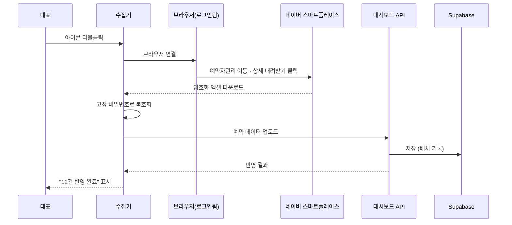
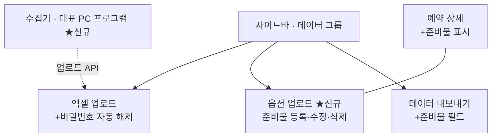
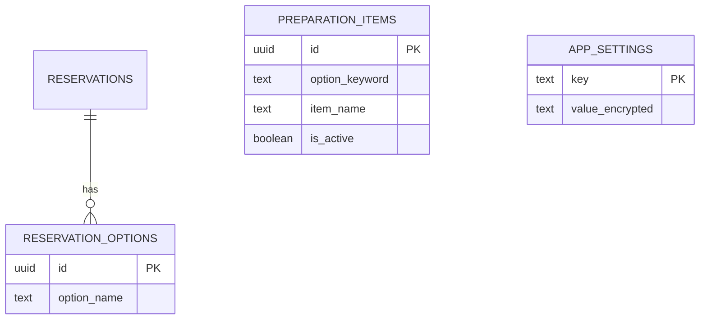
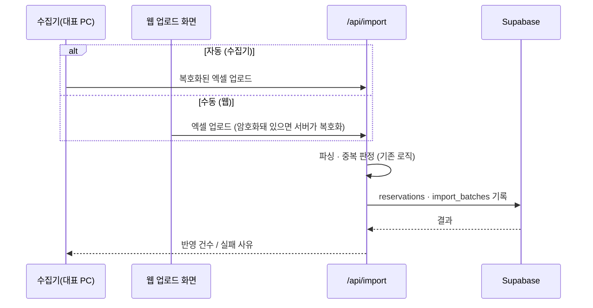

# 고마워할매 대시보드 추가기능 PRD (증분)

> 작성일: 2026-07-17 · 버전: v1.0 · 작성자: Dong ho
> 기준 문서: `prd-gomawohalme-reservation-dashboard-v2-20260709.md` (본 문서는 v2 PRD의 **증분 문서**이며 v2를 덮어쓰지 않는다)
> 다음 단계: FRD (`prd-gomawohalme-addon-20260717-handoff.md` 참조)

---

## 1. 한 문단 요약

이 추가기능은 고마워할매 대표가 매번 손으로 하던 두 가지 일을 자동화한다. 첫째, 네이버 스마트플레이스에서 예약 상세 엑셀을 내려받아 비밀번호를 풀고 대시보드에 올리는 과정을 "로그인만 대표가, 나머지는 전부 자동"으로 바꾼다. 둘째, 예약 옵션(바베큐, 계곡 등)마다 필요한 준비물을 대표가 직접 등록해두면 업로드된 예약의 옵션과 자동으로 매칭되어 예약 상세 화면과 데이터 내보내기에 준비물이 함께 나온다. v2 PRD에 개념으로만 존재하던 "로컬 수집기"(§5.5)와 "준비물 예시"(§5.16)를 실제 구현 가능한 수준으로 구체화하는 것이다.

개발은 1인(Dong ho)이 담당하며, 같은 프로젝트의 협업자가 맡은 SOLAPI 문자 발송 영역(자동안내설정·메시지 템플릿·솔라피 설정·발송 일정·발송 이력·실패 관리 6개 페이지)은 본 문서의 범위에서 제외한다. 주요 리스크는 네이버 화면 구조 변경 시 수집기 클릭 경로가 깨지는 것과, 협업자와 동시에 수정하게 되는 사이드바 파일의 병합 충돌이며, 두 가지 모두 대응 방법을 §7.3에 정리했다.

---

## 2. 왜 만드는가

### 2.1 현재 어떻게 일하고 있나

대표는 예약 데이터를 갱신할 때마다 네이버 스마트플레이스에 로그인해 예약 메뉴로 이동하고, 조회 기간을 맞춘 뒤 "상세 내려받기"를 눌러 엑셀을 받는다. 받은 파일은 비밀번호가 걸려 있어 그대로 대시보드에 올리면 업로드 에러가 난다. 매번 비밀번호를 풀거나 수동으로 처리해야 하고, 이 과정이 익숙하지 않은 대표에게는 갱신 한 번이 부담스러운 작업이다. 준비물 쪽도 마찬가지로, 예약 옵션을 보고 "바베큐면 고기·숯·집게·장갑"을 머릿속 기억이나 메모에 의존해 챙긴다.

### 2.2 무엇이 답답한가

다운로드→비밀번호 해제→업로드가 사람 손을 3번 타기 때문에 갱신 주기가 불규칙해지고, 대시보드의 예약 데이터가 실제보다 뒤처지는 날이 생긴다. 준비물은 v2 개발분에 고정된 예시 표로만 존재해서 실제 운영 옵션이 바뀌거나 새 옵션이 생기면 화면과 현실이 어긋난다. 준비물 누락은 곧바로 고객 경험 문제로 이어진다.

### 2.3 우리가 어떻게 바꾸는가

수집기 프로그램이 대표 PC에서 실행되어, 대표가 로그인해둔 브라우저에 연결해 다운로드 버튼 클릭부터 비밀번호 해제, 대시보드 업로드까지 한 번에 처리한다. 대표가 하는 일은 "아이콘 더블클릭 + (세션이 풀렸을 때만) 로그인" 두 가지로 줄어든다. 준비물은 대시보드 안 "옵션 업로드" 화면에서 대표가 직접 옵션과 준비물을 등록·수정하고, 등록 즉시 모든 예약 상세와 내보내기에 반영된다. 결과적으로 예약 데이터 갱신은 클릭 1번, 준비물 관리는 화면에서 직접 하는 구조가 된다.

---

## 3. 누가 쓰는가

사용자는 v2 PRD와 동일하게 고마워할매 대표(관리자)와 직원이다. 이 추가기능에서 새로 생기는 행동은 모두 관리자 몫이고, 직원은 결과(준비물이 표시된 예약 상세)만 열람한다.

### 3.1 핵심 페르소나

| 변수 | 값 |
|---|---|
| 이름 | 고마워할매 대표 (v2 PRD §4.1 owner와 동일) |
| 직업·역할 | 시골 밥상·체험 업체 운영자, 대시보드 유일 관리자 |
| 디지털 숙련도 | 낮음 — 더블클릭·로그인은 가능, 파일 비밀번호 해제 같은 중간 단계는 부담 |
| 사용 기기 | Windows 11 PC (수집기 실행), PC·모바일 (대시보드) |
| 사용 맥락 | 예약 확인이 필요할 때 수집기 실행, 옵션 구성이 바뀔 때 준비물 등록 |
| 핵심 동기 | 예약 갱신·준비물 확인을 실수 없이 빠르게 |
| 좌절 경험 | 비밀번호 걸린 엑셀 업로드 에러, 준비물 빠뜨림 |
| 의사결정 기준 | "내가 혼자서도 돌릴 수 있는가" |

### 3.2 비대상 사용자

협업자가 맡은 SOLAPI 발송 기능의 사용자 흐름(메시지 수신 고객 포함)은 본 문서 범위 밖이다. 또한 고객(예약자)이 직접 쓰는 화면은 이번 증분에 없다.

---

## 4. 사용자 시나리오

이 추가기능을 어떻게 쓰는지 세 가지 상황으로 보여준다.

### 시나리오 1: 예약 데이터 자동 갱신 (Happy Path)

대표는 아침에 PC에서 수집기 아이콘을 더블클릭한다. 수집기는 미리 열려 있는(또는 이때 자동으로 열리는) 브라우저에 연결해 스마트플레이스 예약자관리 페이지로 이동하고, 조회 기간을 기본값(이용일 기준 한 달)으로 맞춘 뒤 "상세 내려받기" 버튼을 누른다. 다운로드 폴더에 암호화된 엑셀이 떨어지면 수집기가 이를 감지해 설정에 저장된 고정 비밀번호로 해제하고, 대시보드 업로드 API(서버로 데이터를 보내는 표준 통로)를 호출한다. 1~2분 뒤 수집기 창에 "예약 12건 반영 완료"가 표시되고, 대시보드와 업로드 이력에서 같은 결과를 확인할 수 있다.



### 시나리오 2: 세션 만료·실패 처리 (예외)

수집기가 브라우저에 연결했는데 스마트플레이스가 로그인 화면을 보여주면, 수집기는 작업을 멈추고 "네이버 로그인이 필요합니다. 로그인 후 다시 실행해주세요"라고 안내한다. 다운로드 후 비밀번호 해제에 실패하면(비밀번호 변경 등) "파일 비밀번호가 맞지 않습니다"를 표시하고 원본 파일을 보존한다. 어떤 단계에서 실패하든 이미 반영된 데이터는 없으며, 실패 사유가 수집기 화면과 업로드 이력에 남는다. 자동화가 계속 실패하는 최악의 경우에도 폴백이 있다: 대표가 수동으로 다운로드해 지정 폴더에 넣으면 감지→복호화→업로드는 그대로 자동 진행된다.

### 시나리오 3: 준비물 등록과 확인 (최초 설정)

대표는 사이드바 "데이터" 그룹의 "옵션 업로드"에 들어가 옵션명 `바베큐`, 준비물 `고기, 숯, 집게, 장갑`을 입력하고 저장한다. 등록 목록에 바베큐 행이 생기고, 이후 업로드되는 예약 중 옵션에 "바베큐"가 포함된 모든 예약의 상세 화면에 준비물이 표시된다. 데이터 내보내기에서 "준비물" 필드를 포함해 내보내면 엑셀에도 옵션별 준비물이 함께 출력된다. 엑셀에 등록되지 않은 옵션이 있으면 상세 화면에 "준비물 미등록" 표시와 함께 옵션 업로드로 가는 링크가 보인다.

---

## 5. 무엇을 만드는가

이 챕터는 화면 구조·핵심 기능·데이터 모델의 개요다. 정밀한 기능 ID 카탈로그는 핸드오프 파일 §2를 참조한다.

### 5.1 화면 구조

신규 화면은 "옵션 업로드" 1개이고, 기존 화면 3개(엑셀 업로드·예약 상세·데이터 내보내기)에 기능이 추가된다. 수집기는 웹 화면이 아니라 대표 PC에서 도는 별도 프로그램이다.



### 5.2 핵심 기능 (자연어 설명)

#### 5.2.1 네이버 수집기 (자동 다운로드)

대표 PC에서 실행되는 독립 프로그램이다. 실행 환경에 클로드나 별도 AI 도구가 없다는 전제로 만든다. 로그인은 자동화하지 않고(네이버의 자동 로그인 차단·캡차를 정면 돌파하지 않기 위해) 대표가 로그인해둔 브라우저에 연결하는 방식을 쓴다. 버튼은 화면 이미지 인식이 아니라 페이지 요소(HTML 버튼 자체)로 찾기 때문에 해상도나 창 위치에 영향받지 않는다. v2 PRD §5.5의 "로컬 수집기"를 이 방식으로 확정·구체화하는 것이다.

#### 5.2.2 암호화 엑셀 자동 복호화

네이버에서 받은 엑셀은 파일 자체에 비밀번호가 걸려 있다. 비밀번호는 매번 동일하므로 관리자가 설정에 한 번 등록해두면, 수집기와 웹 업로드 화면 양쪽에서 암호화된 파일을 만나면 자동으로 해제한 뒤 기존 파싱 로직에 넘긴다. 웹 화면에서 수동 업로드할 때도 동작하므로 수집기 없이도 비밀번호 에러는 사라진다.

#### 5.2.3 옵션 준비물 등록·매칭

"옵션 업로드" 화면에서 옵션명과 준비물 목록(쉼표 구분)을 직접 입력해 등록한다. 매칭은 등록된 옵션명이 예약 옵션 텍스트에 포함되면 성립하는 방식(부분 일치)이다. 네이버 옵션명이 "바베큐 4인 세트"처럼 수식어가 붙어 와도 "바베큐" 등록만으로 매칭되게 하기 위해서다. 매칭 결과는 예약 상세의 준비물 영역과 데이터 내보내기의 "준비물" 필드에 나타난다. v2 FRD §8의 고정 예시 표를 이 기능이 대체한다.

> 정밀한 기능 ID 카탈로그(A-001~)와 화면별 상태는 핸드오프 파일 §2 참조.

### 5.3 데이터 모델 (개요)

새 테이블은 만들지 않는 방향이다. v2 TRD에 이미 정의된 `preparation_items`(옵션 키워드→준비물)를 그대로 쓰고, 비밀번호 저장용으로 관리자 설정 테이블 하나만 추가한다.



`reservation_options.option_name`과 `preparation_items.option_keyword`의 부분 일치로 매칭한다(저장된 관계가 아니라 조회 시 계산 — 준비물 수정이 과거 예약에도 즉시 반영되게 하기 위해서다).

> 전체 SQL(컬럼·RLS 정책)은 핸드오프 파일 §3 참조.

---

## 6. 어떻게 만드는가

기술 스택은 v2 TRD를 그대로 따르고(새 결정 최소화), 수집기만 새 구성요소로 추가된다. 상세는 TRD 증분에서 다룬다.

### 6.1 기술 구조 (요약)

기존 Next.js 웹앱 + Supabase 구조는 그대로 두고, 대표 PC에 수집기 프로그램이 하나 더 생기는 형태다.

| 영역 | 선택 |
|---|---|
| 웹앱 | 기존 유지 — Next.js 14 App Router, Vercel |
| 데이터베이스 | 기존 유지 — Supabase (preparation_items 재사용) |
| 수집기 | Node.js + Playwright (브라우저 연결·클릭 자동화 도구), Windows 실행 파일로 패키징 |
| 복호화 | 웹: 업로드 API에서 처리 / 수집기: 로컬에서 처리 (같은 비밀번호 사용) |
| 비밀번호 저장 | Supabase 관리자 설정 테이블에 암호화 저장, 관리자만 접근 |

### 6.2 컴포넌트 간 호출 구조

수집기는 대시보드의 기존 업로드 경로를 재사용한다. 웹 업로드든 수집기 업로드든 서버에 도착한 뒤의 처리(복호화→파싱→저장)는 동일하다.



### 6.3 보안 핵심

엑셀 비밀번호는 코드나 설정 파일에 평문으로 두지 않고 Supabase 설정 테이블에 암호화해 저장하며, RLS(행 단위 접근 제어 — 테이블의 각 줄마다 누가 볼 수 있는지 정하는 규칙)로 관리자 역할만 읽을 수 있게 한다. 수집기는 네이버 아이디·비밀번호를 저장하지 않는다(v2 PRD §5.5 원칙 유지). 수집기→API 인증은 관리자 자격의 API 토큰을 수집기 설정에 보관하는 방식이며, 상세 정책은 TRD에서 결정한다.

### 6.4 외부 통합

| 서비스 | 용도 | 인증 방식 |
|---|---|---|
| 네이버 스마트플레이스 (partner.booking.naver.com) | 예약 상세 엑셀 다운로드 | 대표 수동 로그인 (세션 재사용) |
| Supabase | 데이터 저장·설정 보관 | 기존 방식 유지 |

공식 API가 아닌 화면 자동화이므로 네이버 화면 개편 시 수집기 수정이 필요하다. 이 리스크는 §7.3에서 다룬다.

---

## 7. 일정·자원·KPI

### 7.1 일정과 자원

| 항목 | 값 |
|---|---|
| 개발 기간 | 3주 추정 (준비물 1주 · 복호화 0.5주 · 수집기 1.5주) |
| 필요 인력 | 1인 (Dong ho) — 협업자와 병렬 진행 |
| 추가 인프라 비용 | ₩0 (기존 Supabase·Vercel 무료 티어 범위, 수집기는 로컬 실행) |

### 7.2 성공 지표 (KPI)

| KPI | 목표값 | 측정 방법 | 측정 시점 |
|---|---|---|---|
| 예약 갱신 소요 시간 | 대표 조작 기준 10초 이내 (클릭 1회) | 수집기 실행 로그 | 배포 후 2주 |
| 업로드 비밀번호 에러 | 0건 | 업로드 이력의 실패 사유 | 배포 후 상시 |
| 수집기 성공률 | 실행 대비 90% 이상 (세션 만료 제외) | 수집기 로그 | 배포 후 4주 |
| 준비물 미등록 옵션 | 활성 옵션 기준 0건 | 내보내기 파일의 "(미등록)" 표기 집계 (A-004, v1 필수 기능 기반) | 등록 완료 후 |

### 7.3 주요 리스크

- **네이버 화면 개편**: 버튼·메뉴 구조가 바뀌면 수집기 클릭 경로가 깨진다. → 요소 선택자를 설정 파일로 분리해 코드 수정 없이 교체 가능하게 하고, 실패 시 폴백(수동 다운로드→자동 처리)이 항상 동작하게 유지.
- **사이드바 병합 충돌**: 협업자도 같은 사이드바 파일에 메뉴를 추가한다. → 먼저 반영하는 쪽 확정 후 나중 쪽이 리베이스(상대 변경 위에 내 변경을 다시 얹는 것), 메뉴 그룹이 달라 내용 충돌은 없음.
- **비밀번호 변경**: 네이버가 파일 비밀번호 정책을 바꾸면 복호화가 실패한다. → 실패 시 명확한 안내 + 설정 화면에서 관리자가 즉시 갱신 가능.
- **웨일 브라우저 연결**: 대표 PC 브라우저가 웨일로 보이는데, 웨일은 크로미움 기반이라 연결 방식은 동일하나 실행 옵션 경로가 다르다. → 착수 시 브라우저 확정 후 바로가기 아이콘을 그에 맞게 제작 (크롬·웨일 둘 다 지원 가능).

---

## 8. 향후 단계 (v2 이후)

- **수집기 완전 무인화(정시 자동 실행)**: 브라우저 상시 실행·세션 유지 문제가 얽혀 있어 v1은 "대표가 실행" 방식으로 확정. 운영 안정화 후 검토.
- **준비물 수량 자동 계산**: 인원수 기반 수량 계산은 v2 FRD §8 원칙(수량 계산 제외)을 유지. 등록 데이터가 쌓인 뒤 검토.
- **미등록 옵션 자동 알림**: 업로드 시 미등록 옵션을 관리자에게 알리는 기능은 협업자의 알림 인프라(SOLAPI)와 접점이 생기므로 통합 시점에 검토.

---

## 부록 A. 적대적 검토 결과

```
━━━ 🔍 적대적 검토 ━━━
검토 관점: Architect + Dev (FRD 작성자 관점)
검토 대상: 고마워할매 대시보드 추가기능 PRD v1.0

🔴 HIGH-1: 수집기→API 인증 방식 미확정
   문제: 수집기가 업로드 API를 호출할 때의 인증(관리자 토큰 발급·보관·만료)이 "TRD에서 결정"으로만 표시됨.
   영향: FRD에서 업로드 화면·API 명세를 쓸 때 인증 흐름이 비어 막힘.
   수정안: TRD 증분에서 최우선 결정 항목으로 지정 (Supabase service key 직접 사용 금지, 전용 토큰 발급 방식 검토). → 핸드오프 §8에 명시함.

🟡 MEDIUM-1: 다운로드 파일 식별 규칙 부재
   문제: 다운로드 폴더 감시 시 "새 파일"이 네이버 예약 엑셀인지 판별하는 규칙(파일명 패턴)이 없음.
   영향: 다른 다운로드 파일을 잘못 집어 업로드 시도할 수 있음.
   수정안: FRD에서 파일명 패턴 + 수정시각 조건으로 판별 규칙 정의. 실제 파일명 패턴은 첫 실행 시 확인.

🟡 MEDIUM-2: 부분 일치 매칭의 오매칭 가능성
   문제: "계곡"과 "계곡 체험"처럼 키워드가 서로 포함 관계인 경우 중복 매칭됨.
   영향: 준비물이 이중 표시될 수 있음.
   수정안: FRD에서 "가장 긴 키워드 우선 + 중복 준비물 합집합 처리" 규칙 정의.

🟢 LOW-1: 수집기 결과 표시 화면의 디자인 기준 부재
   문제: 수집기는 웹앱 밖 프로그램이라 v3 디자인 토큰 적용 대상인지 불명확.
   영향: 진행에는 지장 없음.
   수정안: 수집기 UI는 최소(텍스트 로그 창)로 하고 디자인 토큰은 적용하지 않는 것으로 확정.

━━━ 요약 ━━━
🔴 HIGH: 1건 / 🟡 MEDIUM: 2건 / 🟢 LOW: 1건
진행 판정: HIGH 1건은 TRD 결정 항목으로 이관 완료(핸드오프 §8) → 진행 가능

⚠️ 오탐 주의: 위 발견 중 실제로는 문제가 아닌 것이 있을 수 있습니다. 최종 판단은 사용자가 합니다.
━━━━━━━━━━━━━━━━━
```
