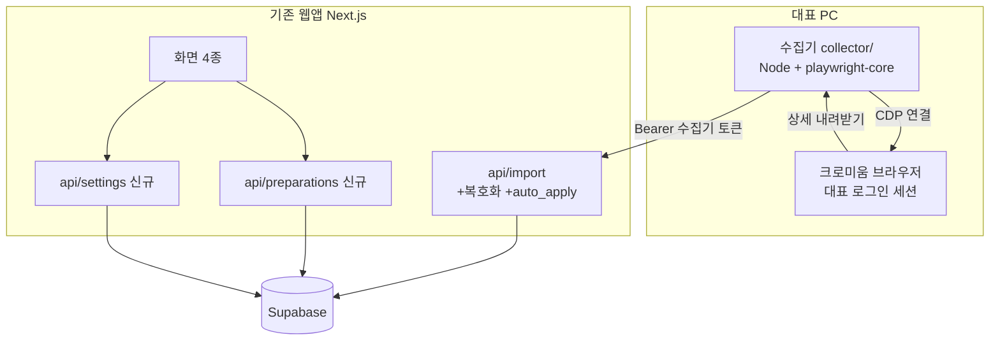
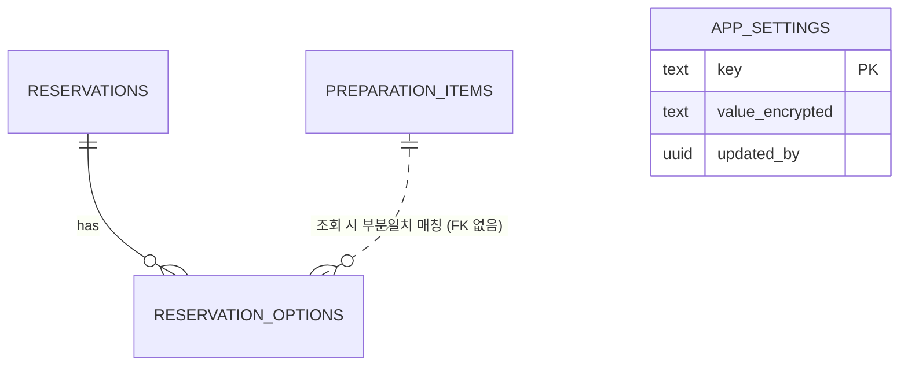

# 고마워할매 대시보드 추가기능 TRD (증분)

> 작성일: 2026-07-17 · 버전: v1.0
> 입력: PRD·FRD 증분 각 2종 (20260717) + v2 TRD (`trd-gomawohalme-reservation-dashboard-v2-20260709`)
> 원칙: v2 TRD의 결정(Next.js·Supabase·모듈러 모놀로식)은 **변경하지 않는다.** 본 문서는 증분 결정만 다룬다
> 다음 단계: 최종 검수 (`trd-gomawohalme-addon-20260717-handoff.md` 참조)

---

## 1. 한 문단 요약

이번 증분에서 새로 내린 기술 결정은 크게 네 가지다. 수집기는 Node.js와 Playwright(브라우저를 코드로 조작하는 검증된 자동화 도구)의 연결 전용 경량판으로 만들어 단일 실행 파일로 배포하고, 엑셀 복호화는 웹 서버와 수집기 양쪽에서 같은 자바스크립트 라이브러리로 처리하며, 비밀번호는 서버 환경변수 키로 암호화해 Supabase에 저장하고, 수집기가 서버에 업로드할 때는 네이버·Supabase 계정이 아닌 전용 발급 토큰 하나만 쓴다. 기존 웹앱의 스택·아키텍처는 손대지 않으므로 협업자 작업과의 기술 충돌은 없다.

추가 운영 비용은 월 ₩0이다(수집기는 대표 PC 로컬 실행, 나머지는 기존 무료 티어 범위). 가장 큰 기술 리스크는 네이버 화면 개편으로, 클릭 대상 선택자를 코드 밖 설정 파일로 빼서 개편 시 파일 교체만으로 대응한다.

---

## 2. 아키텍처 (모듈러 모놀로식 유지)

v2의 모듈러 모놀로식(서비스를 부서별로 나누되 한 건물 안에 두는 구조) 원칙을 유지한다. 수집기는 별도 "서비스"가 아니라 대표 PC에서 실행되는 로컬 도구이며, 서버와는 기존 업로드 API 하나로만 연결된다. 새 서버·큐·워커는 만들지 않는다.



모듈 경계: 준비물(`preparations`)·설정(`settings`)·수집기(`collector/`)는 서로 import하지 않는다. 매칭 로직은 `lib/preparation-match.ts` 단일 파일로 분리해 화면 2곳(상세·내보내기)이 공유한다.

---

## 3. 수집기 스택

### 왜 이걸 골랐는가

수집기의 일은 "이미 열린 브라우저에 접속해 버튼을 누르는 것"이다. 브라우저를 통째로 내장하는 일반 Playwright 배포판(300MB+)은 과하다. 연결 기능만 있는 playwright-core를 쓰면 실행 파일이 가볍고, 대표의 실제 로그인 세션을 그대로 쓰므로 로그인 자동화 리스크(캡차·기기 확인)를 정면으로 피한다. 언어는 웹앱과 같은 TypeScript로 통일해 1인 개발자의 문맥 전환 비용을 없앤다.

| 선택지 | 장점 | 단점 | 판정 |
|---|---|---|---|
| **Node + playwright-core + CDP 연결 (채택)** | 경량, 로그인 세션 재사용, 웹앱과 같은 언어 | 브라우저가 디버그 모드로 열려 있어야 함 | ✅ |
| Python + PyAutoGUI (이미지 인식) | 직관적 | 해상도·가림·마우스 점유 취약, 유지보수 어려움 | ❌ FRD에서 기각됨 |
| Playwright 전체 내장 (자체 브라우저) | 세션 격리 | 네이버 로그인 자동화 필요 → 캡차 리스크 정면 | ❌ |

### 배포 형태

`collector.exe` 단일 실행 파일(Node 런타임 포함 패키징) + `config.json`(선택자·경로·토큰) + 바로가기 2개("수집 실행", "브라우저 열기" — 디버그 포트 옵션 포함 바로가기). 대표 PC에 Node 설치를 요구하지 않는다.

- 비용: ₩0 · 벤더 락인: 없음(오픈소스)
- 마이그레이션: 네이버 개편 시 `config.json`의 선택자만 교체(코드 재배포 불필요). CDP 자체가 막히는 극단적 경우 → 수동 다운로드 폴백(감시 폴더)은 코드 변경 없이 동작 유지.

---

## 4. 복호화·암호화 결정

### 엑셀 복호화 라이브러리

네이버 엑셀은 표준 오피스 암호화(ECMA-376 Agile Encryption) 형식이다. 웹 서버(/api/import)와 수집기 양쪽에서 같은 처리를 해야 하므로, 순수 자바스크립트 라이브러리 하나로 통일한다.

| 선택지 | 장점 | 단점 | 판정 |
|---|---|---|---|
| **officecrypto-tool (npm, 채택)** | 순수 JS — Vercel 서버리스에서 동작, 웹·수집기 공용 | 커뮤니티 규모 소형 | ✅ (실패 대비 검증 테스트 필수) |
| msoffcrypto-tool (Python) | 검증 풍부 | Vercel Node 런타임과 이질, 수집기와 이중 스택 | ❌ |
| SheetJS Pro (유료) | 공식 지원 | 유료 라이선스 | ❌ 무료 범위 초과 |

착수 첫날 실제 네이버 파일로 복호화 검증을 1순위로 수행한다(라이브러리 리스크 조기 제거). 실패 시 대안: 수집기에서만 복호화(로컬은 제약 없음)하고 웹 업로드는 "수집기를 통해 올려주세요" 안내로 축소.

### 비밀번호 저장 암호화

비밀번호는 서버만 아는 키로 잠가서 저장한다. 방식은 AES-256-GCM(현대 표준 대칭 암호화 — 금고에 넣고 열쇠는 서버 환경변수에만 두는 것)이고, 열쇠(`SETTINGS_ENCRYPTION_KEY`)는 Vercel 환경변수에 둔다. DB가 유출돼도 열쇠 없이는 복원할 수 없고, RLS로 관리자 외에는 암호문 접근 자체를 막는다.

| 선택지 | 판정 |
|---|---|
| **AES-256-GCM + 환경변수 키 (채택)** | 구현 단순, 서버리스 호환 ✅ |
| Supabase Vault | 기능 동등하나 v2 스키마에 없던 확장 도입 — 증분 최소화 원칙 위배 ❌ |
| 평문 저장 | 금지 (NFR) ❌ |

---

## 5. 수집기 인증 (최우선 결정 — PRD HIGH-1 해소)

수집기가 업로드 API를 호출할 때 무엇으로 신원을 증명하는가. Supabase service key(모든 권한을 가진 마스터 열쇠)를 수집기에 두는 것은 PC 분실·유출 시 전체 DB가 열리므로 금지한다. 대표의 로그인 세션을 쓰는 것도 만료 관리가 복잡하다. 채택안은 **전용 수집기 토큰**: 서버가 무작위 토큰을 1개 발급하고, DB에는 해시(원문을 복원할 수 없는 지문)만 저장하며, 수집기 `config.json`에 원문을 둔다. 토큰이 유출되면 관리자가 재발급해 기존 것을 즉시 무효화할 수 있다.

| 선택지 | 장점 | 단점 | 판정 |
|---|---|---|---|
| **전용 토큰 (해시 저장·재발급 가능) (채택)** | 권한 최소(업로드만), 즉시 폐기 가능 | 발급 UI 필요 (설정 카드에 버튼 1개) | ✅ |
| Supabase service key | 구현 0분 | 유출 = DB 전체 노출 | ❌ 금지 |
| 대표 계정 세션 | 권한 모델 재사용 | 만료·갱신 복잡, 수집기에 계정 정보 근접 | ❌ |

토큰의 권한 범위는 `/api/import(auto_apply)` 단 하나다. 준비물·설정 API에는 쓸 수 없다.

---

## 6. 데이터·API 변경 요약

DB 변경은 최소다: 신규 테이블 `app_settings` 1개(비밀번호 암호문·토큰 해시 보관), 기존 `preparation_items`에 중복 방지 유니크 인덱스 1개 추가. 매칭은 저장하지 않고 조회 시 계산한다(준비물 수정이 과거 예약에 즉시 반영 — FRD 확정).



API는 신규 2개(`/api/preparations` CRUD, `/api/settings` 저장·상태·토큰 발급)와 기존 1개 확장(`/api/import`: 암호화 감지→복호화, `mode=auto_apply` 추가)이다. auto_apply는 미리보기를 생략하고 즉시 반영하되 `import_batches`(source='local_collector')로 기록되어 기존 "마지막 배치 되돌리기"가 안전판이 된다. 전체 SQL·API 명세는 핸드오프 §2·§4.

---

## 7. 비용·리스크·마이그레이션

### 7.1 비용

| 항목 | 월 비용 |
|---|---|
| 수집기 (로컬 실행) | ₩0 |
| officecrypto-tool 등 라이브러리 | ₩0 (오픈소스) |
| Supabase·Vercel | 기존 무료 티어 내 (테이블 1개·API 2개 추가는 무시 가능 수준) |
| **합계 증분** | **₩0** |

### 7.2 리스크와 대응

- **네이버 화면 개편**: 선택자 `config.json` 분리로 파일 교체 대응. 감지: 수집기가 "버튼 못 찾음"을 명시 보고.
- **officecrypto-tool 호환 실패**: 착수 첫날 실파일 검증. 실패 시 수집기 전용 복호화로 축소 (§4 대안).
- **토큰 유출 (PC 분실)**: 설정 카드에서 재발급 → 기존 토큰 즉시 무효. 권한이 업로드 1개라 피해 상한 낮음.
- **Vercel 서버리스 파일 크기**: 업로드 엑셀은 수 MB 수준 — 서버리스 요청 한도(4.5MB) 초과 가능성 낮음. 초과 시 수집기가 복호화 후 파싱된 JSON을 전송하는 방식으로 전환 가능(마이그레이션 경로 확보).

### 7.3 마이그레이션 경로

모든 신규 코드는 기존 모듈을 수정하지 않고 얹는 구조라, 이번 증분 전체를 제거해도 v2 기능은 그대로 남는다(롤백 용이). 수집기를 폐기하고 공식 API가 생기는 미래에도 `/api/import` 계약은 재사용된다.

---

## 부록 A. 적대적 검토 결과

```
━━━ 🔍 적대적 검토 ━━━
검토 관점: PM + Dev 양방향
검토 대상: 고마워할매 대시보드 추가기능 TRD v1.0

🔴 HIGH-1: officecrypto-tool 실파일 검증 전까지 복호화 결정은 가설
   문제: 네이버 파일의 암호화 방식이 표준(Agile Encryption)이라는 것은 추정. 라이브러리가 못 열면 §4 대안으로 전환해야 함.
   영향: 검증이 늦으면 3주 일정 후반에 재설계.
   수정안: 개발 1일차 검증을 일정 최상단에 고정 (핸드오프 §9 개발 순서 1번으로 명시).

🟡 MEDIUM-1: auto_apply와 v2 필드 소유권 규칙 충돌 가능성
   문제: v2는 "운영상태(정산 등) 업로드 덮어쓰기 금지"가 원칙. auto_apply가 이 규칙을 우회하면 안 됨.
   영향: 수집기 업로드가 직원이 체크한 정산 상태를 지울 수 있음.
   수정안: auto_apply는 기존 반영 로직을 그대로 호출(미리보기 확인만 생략)하는 것으로 명세 — 필드 소유권 로직 재사용. 핸드오프 §4에 명시함.

🟡 MEDIUM-2: 디버그 포트 브라우저의 보안 노출
   문제: 디버그 모드 브라우저는 로컬의 다른 프로그램도 접속 가능.
   영향: 대표 PC에 악성 프로그램이 있다면 세션 접근 이론상 가능.
   수정안: 디버그 포트는 127.0.0.1 바인딩(외부 네트워크 차단, 기본값)이며, 수집 전용 브라우저 프로필을 분리해 상시 사용 브라우저와 섞지 않음. 핸드오프 §6 바로가기 정의에 반영함.

🟢 LOW-1: 수집기 로그의 개인정보
   수정안: 로그에 예약자 이름·전화번호를 남기지 않고 건수만 기록. 핸드오프 §8 반영.

━━━ 요약 ━━━
🔴 HIGH: 1건(일정 반영 완료) / 🟡 MEDIUM: 2건(반영 완료) / 🟢 LOW: 1건(반영 완료)
진행 판정: 진행 가능

⚠️ 오탐 주의: 위 발견 중 실제로는 문제가 아닌 것이 있을 수 있습니다. 최종 판단은 사용자가 합니다.
━━━━━━━━━━━━━━━━━
```
