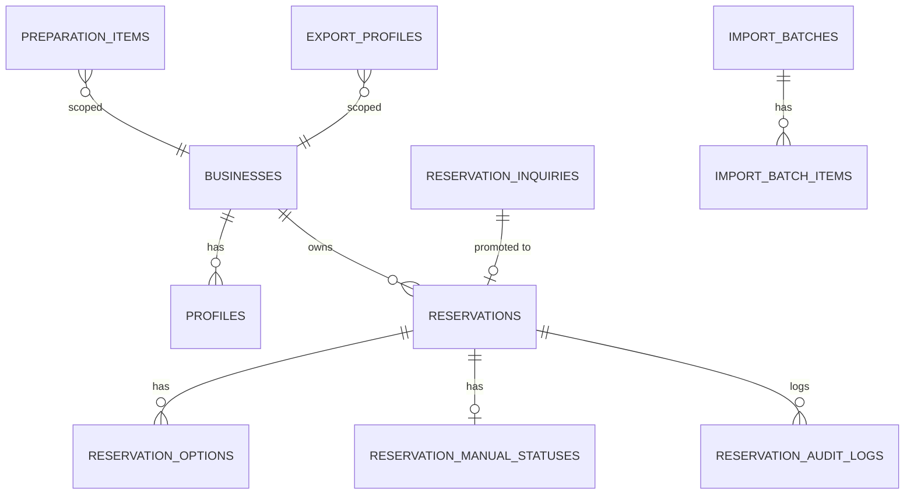

# 고마워할매 예약 운영 대시보드 TRD v2.0 — AI 입력용 핸드오프 팩

> 본문: `trd-gomawohalme-reservation-dashboard-v2-20260709.md`
> 사용처: Claude Code 시스템 프롬프트, 개발 환경 구성, 외주 RFP
> 성격: 정밀 데이터 카탈로그. 부분 참조용.

---

## 1. 잠긴 결정 (Locked Decisions)

- 아키텍처: 모듈러 모놀로식 (admin / ingest / core / status / export)
- 프론트엔드: Next.js 14 App Router + TypeScript + Tailwind + shadcn/ui + Recharts + SheetJS
- 로컬 엑셀 입출력: 파일 선택 버튼 + SheetJS(다운로드 저장). File System Access API는 v1.x 옵션
- 백엔드: Next.js Route Handlers/서버 액션 (별도 서버 없음), 저장은 서버 경유
- DB: Supabase PostgreSQL (리전 ap-northeast-2 서울) + Prisma ORM, 캐시 없음
- 인증: Supabase Auth (이메일/비밀번호) + RLS, 역할 owner/staff
- 호스팅: Vercel (무료 Hobby), 도메인 `.vercel.app`(무료)
- 모니터링: Sentry(무료) + Vercel Analytics
- 외부 AI(텍스트 파싱): **TBD** — v1은 관리자 수동 입력, 스키마는 미리 준비
- 하이브리드 저장: 로컬 엑셀 = 예약 사실정보 원본 / Supabase = 공유본 + 운영상태 원본
- 자체 PK: 내부 `id uuid` + 표시 `display_no`(GMW-YYMMDD-NNN)

---

## 2. package.json 핵심 의존성

```json
{
  "dependencies": {
    "next": "^14.2.0",
    "react": "^18.3.0",
    "react-dom": "^18.3.0",
    "typescript": "^5.4.0",
    "@prisma/client": "^5.14.0",
    "@supabase/supabase-js": "^2.43.0",
    "@supabase/ssr": "^0.3.0",
    "tailwindcss": "^3.4.0",
    "recharts": "^2.12.0",
    "xlsx": "^0.18.5",
    "react-hook-form": "^7.51.0",
    "zod": "^3.23.0",
    "@sentry/nextjs": "^8.0.0"
  },
  "devDependencies": {
    "prisma": "^5.14.0"
  }
}
```

> `xlsx`(SheetJS)는 CDN이 아닌 npm 번들로 고정(오프라인·CDN 차단 대비). 구 v1 QA HIGH 이슈(CDN 의존) 해소.

---

## 3. 데이터베이스 (정밀)

### 3.1 ERD (전체)



### 3.2 CREATE TABLE 전문

```sql
-- 사업장 (v1 1곳 전용, 확장 훅)
CREATE TABLE businesses (
  id uuid PRIMARY KEY DEFAULT gen_random_uuid(),
  name text NOT NULL,
  created_at timestamptz NOT NULL DEFAULT now()
);

-- 사용자 프로필 (Supabase auth.users와 1:1)
CREATE TABLE profiles (
  id uuid PRIMARY KEY REFERENCES auth.users(id) ON DELETE CASCADE,
  business_id uuid NOT NULL REFERENCES businesses(id),
  name text NOT NULL,
  email text NOT NULL,
  role text NOT NULL CHECK (role IN ('owner','staff')),
  status text NOT NULL DEFAULT 'active' CHECK (status IN ('active','inactive')),
  created_at timestamptz NOT NULL DEFAULT now()
);

-- 예약 (자체 PK + 네이버 예약번호 선택)
CREATE TABLE reservations (
  id uuid PRIMARY KEY DEFAULT gen_random_uuid(),
  business_id uuid NOT NULL REFERENCES businesses(id),
  display_no text NOT NULL,                         -- 표시번호 GMW-260709-001
  reservation_no text,                              -- 네이버 예약번호(있으면), 없으면 NULL
  source text NOT NULL CHECK (source IN ('excel','local_collector','text_inquiry')),
  guest_name text NOT NULL,
  guest_phone text NOT NULL,
  visit_start_date date NOT NULL,
  visit_end_date date,
  pax integer NOT NULL DEFAULT 0,
  channel text,
  paid_amount integer NOT NULL DEFAULT 0,
  reservation_status text NOT NULL CHECK (reservation_status IN ('confirmed','changed','cancelled')),
  imported_at timestamptz,
  created_at timestamptz NOT NULL DEFAULT now(),
  updated_at timestamptz NOT NULL DEFAULT now(),
  UNIQUE (business_id, display_no)
);
-- 네이버 예약번호는 있을 때만 사업장 내 유일 (부분 유니크 인덱스, §3.4)

-- 예약 옵션
CREATE TABLE reservation_options (
  id uuid PRIMARY KEY DEFAULT gen_random_uuid(),
  reservation_id uuid NOT NULL REFERENCES reservations(id) ON DELETE CASCADE,
  option_name text NOT NULL,
  quantity integer,
  raw_text text,
  created_at timestamptz NOT NULL DEFAULT now()
);

-- 운영 상태 (Supabase가 원본 — 업로드로 덮어쓰기 금지 대상)
CREATE TABLE reservation_manual_statuses (
  reservation_id uuid PRIMARY KEY REFERENCES reservations(id) ON DELETE CASCADE,
  settlement_status text NOT NULL DEFAULT 'needs_check'
    CHECK (settlement_status IN ('needs_check','completed','not_applicable')),
  tax_invoice_status text NOT NULL DEFAULT 'needs_check'
    CHECK (tax_invoice_status IN ('needs_check','issued','not_applicable')),
  memo text,
  updated_by uuid REFERENCES profiles(id),
  updated_at timestamptz NOT NULL DEFAULT now()
);

-- 텍스트 예약 문의 (검수 후 예약 승격)
CREATE TABLE reservation_inquiries (
  id uuid PRIMARY KEY DEFAULT gen_random_uuid(),
  business_id uuid NOT NULL REFERENCES businesses(id),
  raw_text text NOT NULL,                           -- 원문 보존
  parsed jsonb,                                     -- {guest_name,phone,date,pax,options...} (수동/AI)
  status text NOT NULL DEFAULT 'pending'
    CHECK (status IN ('pending','confirmed','rejected')),
  promoted_reservation_id uuid REFERENCES reservations(id),
  created_by uuid REFERENCES profiles(id),
  created_at timestamptz NOT NULL DEFAULT now()
);

-- 준비물 예시
CREATE TABLE preparation_items (
  id uuid PRIMARY KEY DEFAULT gen_random_uuid(),
  business_id uuid NOT NULL REFERENCES businesses(id),
  option_keyword text NOT NULL,
  item_name text NOT NULL,
  note text,
  is_active boolean NOT NULL DEFAULT true
);

-- 업로드/수집 배치
CREATE TABLE import_batches (
  id uuid PRIMARY KEY DEFAULT gen_random_uuid(),
  business_id uuid NOT NULL REFERENCES businesses(id),
  source text NOT NULL CHECK (source IN ('excel','local_collector','text_inquiry')),
  file_name text,
  uploaded_by uuid REFERENCES profiles(id),
  status text NOT NULL DEFAULT 'preview'
    CHECK (status IN ('preview','applied','failed','reverted')),
  total_count integer DEFAULT 0,
  new_count integer DEFAULT 0,
  update_count integer DEFAULT 0,
  cancel_count integer DEFAULT 0,
  error_count integer DEFAULT 0,
  local_file_saved boolean DEFAULT false,           -- 로컬 엑셀 저장 성공 여부(동기화 검증)
  created_at timestamptz NOT NULL DEFAULT now(),
  applied_at timestamptz
);

-- 배치 항목 (되돌리기용 before/after)
CREATE TABLE import_batch_items (
  id uuid PRIMARY KEY DEFAULT gen_random_uuid(),
  batch_id uuid NOT NULL REFERENCES import_batches(id) ON DELETE CASCADE,
  reservation_no text,
  display_no text,
  action text NOT NULL CHECK (action IN ('create','update','skip','error','merge')),
  before_data jsonb,
  after_data jsonb,
  error_message text
);

-- 수정 이력
CREATE TABLE reservation_audit_logs (
  id uuid PRIMARY KEY DEFAULT gen_random_uuid(),
  reservation_id uuid NOT NULL REFERENCES reservations(id) ON DELETE CASCADE,
  field_name text NOT NULL,
  old_value text,
  new_value text,
  changed_by uuid REFERENCES profiles(id),
  changed_at timestamptz NOT NULL DEFAULT now()
);

-- 내보내기 프로필 (원하는 필드만 엑셀로)
CREATE TABLE export_profiles (
  id uuid PRIMARY KEY DEFAULT gen_random_uuid(),
  business_id uuid NOT NULL REFERENCES businesses(id),
  name text NOT NULL,
  columns jsonb NOT NULL,                           -- ["display_no","visit_start_date","guest_name",...]
  filters jsonb,                                    -- {status, period ...}
  created_by uuid REFERENCES profiles(id),
  created_at timestamptz NOT NULL DEFAULT now()
);
```

### 3.3 RLS 정책

```sql
-- 공통: 같은 business_id만 접근
ALTER TABLE reservations ENABLE ROW LEVEL SECURITY;
ALTER TABLE reservation_options ENABLE ROW LEVEL SECURITY;
ALTER TABLE reservation_manual_statuses ENABLE ROW LEVEL SECURITY;
ALTER TABLE reservation_inquiries ENABLE ROW LEVEL SECURITY;
ALTER TABLE import_batches ENABLE ROW LEVEL SECURITY;
ALTER TABLE import_batch_items ENABLE ROW LEVEL SECURITY;
ALTER TABLE reservation_audit_logs ENABLE ROW LEVEL SECURITY;
ALTER TABLE preparation_items ENABLE ROW LEVEL SECURITY;
ALTER TABLE export_profiles ENABLE ROW LEVEL SECURITY;
ALTER TABLE profiles ENABLE ROW LEVEL SECURITY;

-- 헬퍼: 현재 사용자의 business_id
CREATE OR REPLACE FUNCTION current_business_id() RETURNS uuid
LANGUAGE sql STABLE AS $$
  SELECT business_id FROM profiles WHERE id = auth.uid()
$$;

-- 헬퍼: 현재 사용자가 owner인가
CREATE OR REPLACE FUNCTION is_owner() RETURNS boolean
LANGUAGE sql STABLE AS $$
  SELECT EXISTS (SELECT 1 FROM profiles WHERE id = auth.uid() AND role='owner' AND status='active')
$$;

-- 예약: 같은 사업장이면 조회(직원 포함), 쓰기는 서버(Service Role)만
CREATE POLICY reservations_select ON reservations
  FOR SELECT USING (business_id = current_business_id());
-- INSERT/UPDATE/DELETE 정책 없음 → anon/authenticated 불가, 서버(service_role)만 우회

-- 운영상태: 조회는 같은 사업장, 수정은 활성 사용자(owner+staff 모두 허용)
CREATE POLICY manual_status_select ON reservation_manual_statuses
  FOR SELECT USING (
    reservation_id IN (SELECT id FROM reservations WHERE business_id = current_business_id())
  );
CREATE POLICY manual_status_update ON reservation_manual_statuses
  FOR UPDATE USING (
    reservation_id IN (SELECT id FROM reservations WHERE business_id = current_business_id())
  );

-- 텍스트 문의·배치·감사로그: owner만 쓰기, 같은 사업장 조회
CREATE POLICY inquiries_select ON reservation_inquiries
  FOR SELECT USING (business_id = current_business_id());
CREATE POLICY inquiries_write ON reservation_inquiries
  FOR ALL USING (business_id = current_business_id() AND is_owner());

-- 프로필: 본인 조회 + owner는 사업장 전체 조회/관리
CREATE POLICY profiles_self ON profiles
  FOR SELECT USING (id = auth.uid() OR (business_id = current_business_id() AND is_owner()));
```

> 원칙: **reservations 사실정보 쓰기는 브라우저 불가, Next.js 서버(Service Role Key)만** 수행. 운영상태(정산·세금·메모)만 직원 UPDATE 허용.

### 3.4 인덱스

```sql
CREATE INDEX idx_res_business_visit ON reservations(business_id, visit_start_date);
CREATE INDEX idx_res_status ON reservations(business_id, reservation_status);
CREATE INDEX idx_res_display_no ON reservations(business_id, display_no);
-- 네이버 예약번호는 있을 때만 사업장 내 유일
CREATE UNIQUE INDEX uq_res_reservation_no
  ON reservations(business_id, reservation_no)
  WHERE reservation_no IS NOT NULL;
-- 중복 병합 후보 탐색용 (이름+연락처+방문일)
CREATE INDEX idx_res_merge_key ON reservations(business_id, guest_name, guest_phone, visit_start_date);
CREATE INDEX idx_inq_status ON reservation_inquiries(business_id, status);
CREATE INDEX idx_batch_items_batch ON import_batch_items(batch_id);
```

### 3.5 Prisma schema.prisma (발췌)

```prisma
model Reservation {
  id                String   @id @default(uuid())
  businessId        String   @map("business_id")
  displayNo         String   @map("display_no")
  reservationNo     String?  @map("reservation_no")
  source            String   // excel | local_collector | text_inquiry
  guestName         String   @map("guest_name")
  guestPhone        String   @map("guest_phone")
  visitStartDate    DateTime @map("visit_start_date") @db.Date
  visitEndDate      DateTime? @map("visit_end_date") @db.Date
  pax               Int      @default(0)
  channel           String?
  paidAmount        Int      @default(0) @map("paid_amount")
  reservationStatus String   @map("reservation_status")
  options           ReservationOption[]
  manualStatus      ReservationManualStatus?
  createdAt         DateTime @default(now()) @map("created_at")
  updatedAt         DateTime @updatedAt @map("updated_at")
  @@unique([businessId, displayNo])
  @@map("reservations")
}
// business_id: v1 단일 고정값(1곳 전용). 다중 사업장은 확장 훅으로만 존재.
```

### 3.6 ⭐ 필드별 소유권 (업로드 덮어쓰기 규칙 — HIGH-1 대응)

| 필드 그룹 | 원본(소유권) | 엑셀 업로드 시 |
|---|---|---|
| 방문일·인원·옵션·금액·예약상태·연락처·유입경로 | **로컬 엑셀** | 업데이트 가능 |
| display_no(자체 PK) | 시스템 | 최초 1회 부여, 유지 |
| settlement_status / tax_invoice_status / memo | **Supabase** | **덮어쓰기 금지(SKIP)** |

업로드 반영 로직은 `reservation_manual_statuses`를 절대 UPDATE하지 않는다. 신규 예약일 때만 기본값(needs_check) 생성.

### 3.7 ⭐ 자체PK ↔ 네이버 예약번호 병합 규칙 (HIGH-2 대응)

```
텍스트 문의 승격 또는 엑셀 업로드 시:
1. reservation_no가 이미 존재 → 해당 행 UPDATE (기존 로직)
2. reservation_no 없음(텍스트발) → display_no로 신규 생성
3. 나중에 같은 예약이 네이버 엑셀로 유입되면:
   - (business_id, guest_name, guest_phone, visit_start_date)로 후보 검색
   - 후보 있으면 미리보기에 "병합 후보"로 표시 (action='merge')
   - 관리자가 확인 → 기존 display_no 행에 reservation_no를 붙임(신규 생성 X)
   - 관리자가 "다른 예약"이라 하면 별도 생성
* 완전 자동 병합 금지 — 항상 관리자 확인식
```

### 3.8 ⭐ 로컬↔Supabase 동기화 (MEDIUM-2 대응)

```
반영하기 클릭 시 처리 순서:
1. import_batch status='preview' → 서버가 Supabase 트랜잭션 시작
2. reservations/options upsert (운영상태 제외)
3. 성공 시 브라우저가 로컬에 새 엑셀 저장 → 성공하면 batch.local_file_saved=true
4. Supabase 실패 → 트랜잭션 롤백, batch status='failed', 로컬 저장 안 함
5. 로컬 저장 실패(브라우저) → batch status='applied'이나 local_file_saved=false 경고 표시
   → "로컬 엑셀 저장에 실패했습니다. 다시 내보내기 하세요" 안내
6. 되돌리기: 마지막 applied 배치의 import_batch_items.before_data로 복원(1건)
```

---

## 4. 보안 정책 상세

### 4.1 인증·인가
- Supabase Auth 이메일/비밀번호. 세션은 `@supabase/ssr`로 서버·클라이언트 공유.
- 역할: owner(대표) = 업로드·문의입력·직원관리·내보내기설정 / staff = 조회 + 운영상태 체크.
- reservations 사실정보 쓰기: authenticated 정책 없음 → Service Role(서버)만.
- 비활성 계정(status='inactive')은 로그인 후에도 RLS 헬퍼에서 제외.

### 4.2 데이터 보호
- 전송 HTTPS, 저장 리전 ap-northeast-2(서울).
- 연락처: 목록 마스킹(`010-****-5678`), 상세 전체. 마스킹은 조회 시 애플리케이션 레벨.
- 원본 엑셀 파일: Supabase Storage 미사용, 로컬만.
- 개인정보 파기 주기: **운영 규정에서 확정 필요(누락 결정)**.

### 4.3 Rate Limiting
- 업로드/파싱 엔드포인트에 사용자당 분당 호출 제한(예: 10/min) — Next.js 미들웨어 또는 Vercel 설정.

---

## 5. 환경변수 목록 (.env.example)

```bash
# Supabase (서울 리전 프로젝트)
NEXT_PUBLIC_SUPABASE_URL=
NEXT_PUBLIC_SUPABASE_ANON_KEY=        # 브라우저용(권한 제한)
SUPABASE_SERVICE_ROLE_KEY=            # ⚠️ 서버 전용, 절대 클라이언트 노출 금지

# DB (Prisma)
DATABASE_URL=                         # Supabase Postgres 연결 문자열(pooled)
DIRECT_URL=                           # 마이그레이션용 direct 연결

# 모니터링
SENTRY_DSN=
NEXT_PUBLIC_SENTRY_DSN=

# 텍스트 파싱 AI (TBD — 도입 시 활성화)
# LLM_API_KEY=                        # 서버 전용
# LLM_MODEL=
```

---

## 6. 외부 서비스 가입 가이드

### 6.1 Supabase
- 가입: supabase.com → New project → **Region: Northeast Asia (Seoul) ap-northeast-2**
- 무료 한도: DB 500MB, MAU 50,000 (고마워할매 규모 여유)
- 필수 설정: Auth Email 활성화, RLS 전 테이블 활성화(§3.3), Service Role Key 서버 env에만
- 핵심 env: NEXT_PUBLIC_SUPABASE_URL, NEXT_PUBLIC_SUPABASE_ANON_KEY, SUPABASE_SERVICE_ROLE_KEY

### 6.2 Vercel
- 가입: vercel.com → GitHub 연동 → Import → 자동 배포
- 무료 Hobby, 도메인 `{project}.vercel.app`
- 환경변수 등록(§5) Production/Preview 모두

### 6.3 Sentry
- 가입: sentry.com → Next.js 프로젝트 → `@sentry/nextjs` 마법사
- 무료 5,000 이벤트/월

### 6.4 텍스트 파싱 AI (TBD)
- 도입 결정 시 Claude/GPT/Gemini 중 택1, 서버 라우트에서만 호출, 결과는 `reservation_inquiries.parsed`에 저장 후 관리자 검수.

---

## 7. 배포·운영

### 7.1 CI/CD
- Vercel 내장(Git push → 자동 배포·프리뷰·롤백). 별도 GitHub Actions 불필요.
- DB 마이그레이션: `prisma migrate deploy`를 배포 훅 또는 수동 실행.

### 7.2 Vercel 환경변수 체크리스트
- [ ] NEXT_PUBLIC_SUPABASE_URL (Production+Preview)
- [ ] NEXT_PUBLIC_SUPABASE_ANON_KEY (Production+Preview)
- [ ] SUPABASE_SERVICE_ROLE_KEY (Production only, Sensitive)
- [ ] DATABASE_URL / DIRECT_URL
- [ ] SENTRY_DSN / NEXT_PUBLIC_SENTRY_DSN

### 7.3 도메인
- v1: `.vercel.app` 그대로. 추후 유료 도메인 시 Vercel Domains에서 연결.

### 7.4 ⭐ 로컬 엑셀 저장 규칙 (MEDIUM-1 대응)
- 파일명: `예약마스터_YYYYMMDD_HHmm.xlsx` (날짜·시각별 새 파일, **덮어쓰기 금지**)
- 저장 위치: 대표가 지정한 로컬 폴더(예: `C:\gomawo\data\`, OneDrive 등 클라우드 동기화 폴더 회피 권장)
- 내보내기: export_profiles의 columns/filters에 따라 원하는 필드만 포함
- 백업: 날짜별 파일이 이력 역할. 주기적 외부 백업은 대표 운영 권장

---

## 8. 모니터링·로깅

- 에러: Sentry (업로드·파싱·저장 실패 자동 캡처)
- 성능: Vercel Analytics
- 감사: reservation_audit_logs(운영상태/메모 변경) + import_batches(업로드 이력)
- 로그 보존: Sentry 무료 30일 / DB 감사로그 영구

---

## 9. NFR 정밀 수치

| 항목 | 요구 | 측정 | 임계 |
|---|---|---|---|
| 대시보드 응답 | p95 < 800ms | Vercel Analytics | 1.5s |
| 업로드 100건 반영 | < 5s | 수동/로그 | 10s |
| 가용성 | 99% (내부도구) | UptimeRobot(선택) | 10분 다운 |
| DB 쿼리 | p95 < 150ms | Supabase Dashboard | 500ms |

---

## 10. 마이그레이션 경로 (벤더 락인 해소)

| 서비스 | 전환 시 작업 |
|---|---|
| Vercel → 자체 호스팅 | Dockerfile 작성, `next start` 구동 |
| Supabase → Neon+Auth.js | Postgres 덤프 이관(표준), RLS→앱레벨 권한 재구현, Auth 이관 |
| Supabase Auth → NextAuth | 사용자 재초대 또는 비밀번호 리셋 |
| 로컬 엑셀 방식 유지 | 포맷 표준(xlsx)이라 이전 부담 없음 |

---

## 11. AI 바이브코딩 호환성 체크

- [x] 모든 결정에 라이브러리 버전 명시(§2)
- [x] DB 스키마 SQL + Prisma schema 포함(§3)
- [x] RLS 정책 SQL 포함(§3.3)
- [x] 환경변수 .env.example(§5)
- [x] 필드 소유권·병합·동기화 규칙 명문화(§3.6~3.8)
- [x] 배포·로컬저장 규칙(§7)
- [ ] 텍스트 파싱 AI 구체안 — TBD(도입 시 §6.4 채움)

---

## 12. 다음 스킬 호출

**다음 단계**: 브랜드 전략 (선택) 또는 PRD/FRD 부분 수정(진행 예정)
**호출 방법**: `"브랜드 전략 수립해줘"`
**brand-strategy 입력**: PRD 본문+핸드오프, FRD 본문+핸드오프, TRD 본문(`trd-...-v2-20260709.md`), TRD 핸드오프(본 파일)

> ⚠️ 정합성 메모: PRD/FRD가 아직 7/7 Supabase 전제·구 KPI 문구를 담고 있으므로, 본 TRD v2와 맞추려면 PRD/FRD 부분 수정이 필요(로컬 엑셀 마스터·자체 PK·텍스트 문의·필드 소유권·KPI '취소 제외' 문구).
