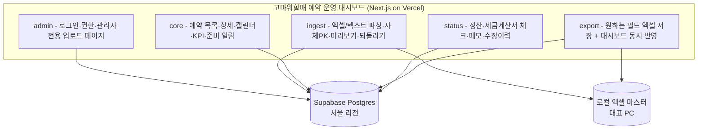
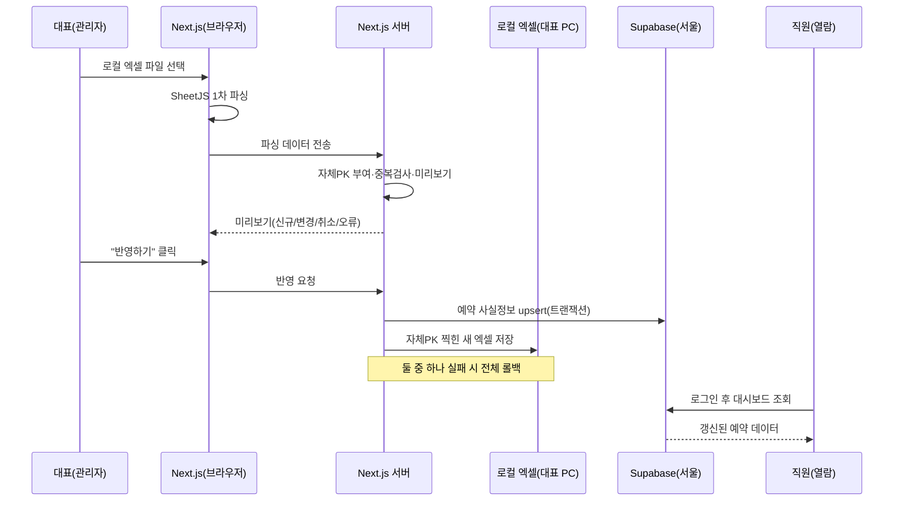
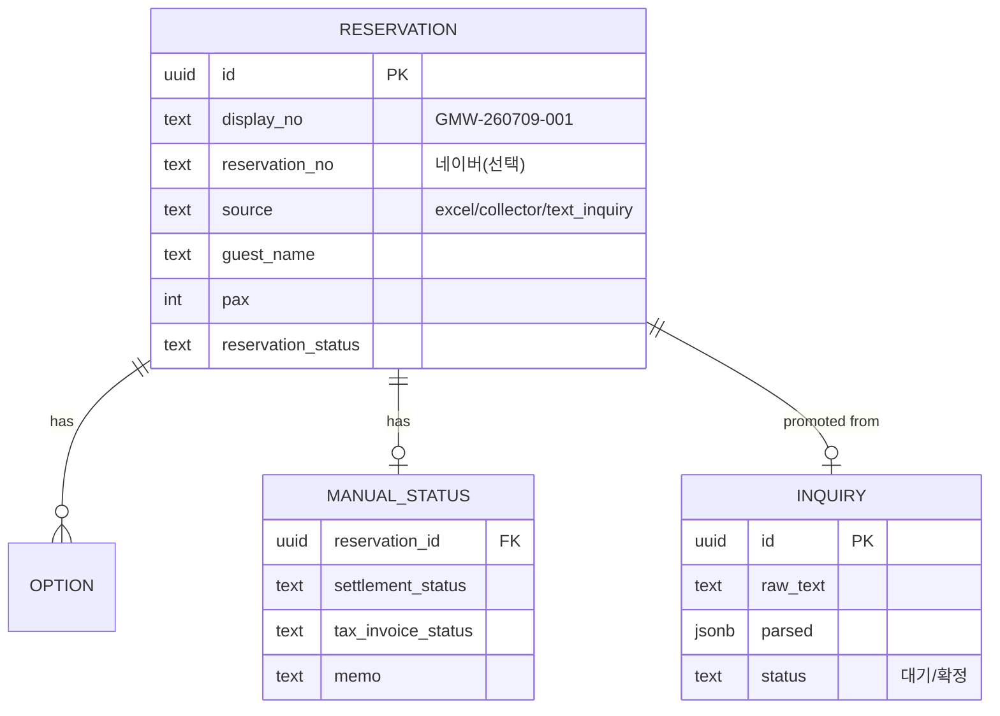

# 고마워할매 예약 운영 대시보드 TRD v2.0

> 작성일: 2026-07-09 · 버전: v2.0 (로컬 엑셀 마스터 + Supabase 하이브리드로 재작성)
> PRD: `prd-gomawohalme-reservation-dashboard-v1.md`
> FRD: `frd-gomawohalme-reservation-dashboard-v1.md`
> 이전 TRD: `trd-고마워할매예약대시보드-20260701.md`(로컬 단일 HTML) → 본 문서로 대체
> 다음 단계: 브랜드 전략 (`trd-gomawohalme-reservation-dashboard-v2-20260709-handoff.md` 참조)

---

## 1. 한 문단 요약

이 시스템은 **모듈러 모놀로식**(코드를 하나의 앱에 담되 기능별 칸막이로 나눈 구조 — 건물 하나를 부서별 사무실로 나눈 것)으로 구성되며, 프론트엔드는 **Next.js(App Router) + TypeScript + Tailwind + shadcn/ui**, 백엔드는 별도 서버 없이 **Next.js의 서버 기능(Route Handlers/서버 액션)**, 데이터는 **Supabase의 PostgreSQL(서울 리전)**에 저장하고 코드에서는 **Prisma**로 다룬다. 이 조합을 선택한 가장 큰 이유는, 관리자(대표)만 엑셀을 업로드하고 직원은 각자 기기에서 갱신된 대시보드를 열람하는 요구를 만족하려면 온라인 인증과 공유 저장소가 반드시 필요한데, 그 셋(로그인·권한·DB)을 한 번에 주는 Supabase가 1~2인·3개월 출시에 가장 단순하기 때문이다. 다만 이 시스템의 핵심 특징은 **원본 예약 데이터를 대표 PC의 로컬 엑셀에 마스터로 두고(자체 PK 부여), 직원 공유용 사본만 Supabase에 반영하는 하이브리드 구조**라는 점이다.

월 운영비는 고마워할매 규모(사용자 3~4명, 월 예약 수십 건)에서 개발·베타·v1 모두 **월 0원**이며, 사용자·트래픽이 수천 단위로 커지는 먼 미래에만 Vercel Pro($20)·Supabase Pro($25) 전환을 검토한다. 가장 큰 기술 리스크는 세 가지다. 첫째, 로컬 엑셀과 Supabase 두 저장소의 **진실 공급원(어느 쪽이 원본이냐)이 뒤섞이면** 직원이 체크한 정산 상태가 대표의 재업로드로 사라질 수 있어, 필드별 소유권을 분리해 이를 원천 차단한다. 둘째, 네이버 예약번호가 없는 **텍스트 문의를 정식 예약과 중복 생성**할 위험이 있어, 자체 PK ↔ 네이버 예약번호를 관리자 확인식으로 병합한다. 셋째, 고객 연락처가 온라인(Supabase)에 저장되므로 **개인정보 보호**가 필수 요구사항이며, 서울 리전·RLS·마스킹으로 관리한다.

---

## 2. 어떤 그림으로 만드는가 (아키텍처)

전체는 하나의 Next.js 앱(모듈러 모놀로식)이며, Vercel에 배포되어 화면과 서버 처리를 한 건물 안에서 수행한다. 특이한 점은 데이터가 두 곳에 나뉜다는 것이다 — **예약 사실 정보의 원본은 대표 PC 로컬 엑셀**, **직원이 보는 공유본과 운영 상태는 Supabase**에 있다.

### 2.1 아키텍처 결정 — 모듈러 모놀로식

1~2인이 3개월 안에 출시·운영해야 하는 상황에서 MSA(마이크로서비스 — 기능마다 서버를 따로 두는 방식)를 도입하면 서버를 여러 대 운영하고 서버 간 통신·장애 대응을 신경 써야 해 현실적으로 불가능하다. 반대로 아무 칸막이 없는 단순 모놀로식은 코드가 커질수록 어디에 뭐가 있는지 찾기 어려워진다. 그래서 **하나의 앱 안을 기능별 모듈로 나눈 모듈러 모놀로식**을 택한다. 서버는 하나(Vercel)로 운영하면서도 코드는 부서별로 정리돼 있고, 나중에 정말 필요해지면 한 모듈만 떼어내 확장할 수 있다.

| 항목 | 모듈러 모놀로식 (선택) | MSA | 순수 로컬 단일 HTML(구 v1안) |
|---|---|---|---|
| 초기 개발 속도 | 빠름 | 느림 | 가장 빠름 |
| 운영 부담 | 낮음(서버 1) | 높음(서버 N) | 없음 |
| 직원·멀티기기 공유 | 가능 | 가능 | 불가(대표 PC만) |
| 1~2인 팀 적합도 | 매우 적합 | 부적합 | 적합하나 협업 불가 |
| 월 비용 | 무료~ | 50만원+ | 무료 |

구 v1안(로컬 단일 HTML)은 협업이 불가능해 이번 요구(직원 공유)를 만족하지 못하므로 탈락했다.

### 2.2 모듈 분해

FRD의 화면을 기능별로 묶어 5개 모듈로 나눴다. 인증·업로드처럼 위험한 일은 관리자 모듈로 격리하고, 직원이 보는 조회 기능은 core로 모았다.



### 2.3 모듈 간 통신

모듈끼리는 별도 네트워크 통신 없이 **같은 앱 안에서 함수 호출**로 데이터를 주고받는다. 예를 들어 대표가 엑셀을 올리면 `ingest`가 파싱·자체 PK 부여·중복 검사를 수행한 뒤, 그 결과를 `core`가 읽어 대시보드를 그리고, `status`가 운영 상태(정산·세금계산서)를 관리한다. 저장 시에는 `ingest`/`export`가 로컬 엑셀과 Supabase 두 곳을 한 묶음으로 처리한다(§4·§5 참조).

---

## 3. 어떤 도구로 만드는가 (기술 스택)

이 챕터에서는 프론트엔드·백엔드·DB·인증·인프라·외부 6개 영역의 결정을 본다. 대부분 7/7 문서의 스택을 계승하되, **로컬 엑셀 입출력**과 **자체 PK·텍스트 문의**만 새로 얹었다.

### 3.1 프론트엔드

화면 도구는 업계 표준이자 이번 조건(Vercel 배포·AI 코딩 도구 궁합)에 그대로 맞는 **Next.js(App Router) + TypeScript**를 택했다. 스타일은 빠른 개발과 일관성을 주는 **Tailwind CSS**, 버튼·표 같은 UI 부품은 복사해서 자유롭게 고칠 수 있는 **shadcn/ui**, KPI·매출 그래프는 **Recharts**로 그린다. 이번 재작성의 프론트 특이점은 **대표 PC의 로컬 엑셀을 브라우저에서 직접 읽는 방식**인데, 보안상 웹은 남의 PC 파일을 함부로 못 만지므로 **"파일 선택 버튼"**으로 대표가 직접 고른 엑셀만 **SheetJS**(브라우저 안에서 엑셀을 읽고 쓰는 번역기)로 해석한다.

📚 **미니 강의**: 브라우저는 기본적으로 사용자 PC 파일을 못 건드린다(아무 사이트나 내 하드를 뒤지면 위험하니까). 그래서 대표가 "파일 선택"으로 직접 고른 엑셀 하나만 안전하게 읽는다.

| 영역 | 선택 | 대안 | 선택 이유 |
|---|---|---|---|
| 프레임워크 | Next.js (App Router) | Remix, SvelteKit | Vercel 1클릭 배포, AI 도구 궁합 최고 |
| 언어 | TypeScript | JavaScript | 타입 검사로 AI 코드 실수 감소 |
| 스타일 | Tailwind CSS | CSS Modules | 빠른 개발·일관성 |
| UI 컴포넌트 | shadcn/ui | MUI, Chakra | 복사식·커스텀 자유 |
| 차트 | Recharts | Chart.js | KPI·매출 그래프 |
| 엑셀 입출력 | SheetJS + 파일 선택 버튼 | File System Access API | 모든 브라우저 지원, 안전 |

> 정밀 버전(`next@14.2.x` 등)과 package.json은 핸드오프 §2 참조.

### 3.2 백엔드

별도 백엔드 서버를 세우지 않고 **Next.js에 딸린 서버 기능(Route Handlers/서버 액션)**만 쓴다. 엑셀 파싱의 절반이 이미 대표 브라우저에서 일어나므로 큰 서버가 필요 없고, 배포도 Vercel 하나로 끝난다. 다만 개인정보(연락처)가 오가고 자체 PK 부여·중복 병합 같은 처리가 있어, **저장은 브라우저가 Supabase로 직접 하지 않고 Next.js 서버를 한 번 거친다.** 이렇게 하면 Supabase 마스터 열쇠(Service Role Key)를 서버에만 숨겨둘 수 있고, PK 부여·검증을 일관되게 처리할 수 있다.

📚 **미니 강의**: 창고(Supabase)에 물건을 넣을 때 주방(Next.js 서버)이 한 번 검수하고 넣는다. 창고 열쇠는 주방이 숨겨 쥔다.

| 영역 | 선택 | 대안 | 선택 이유 |
|---|---|---|---|
| 런타임 | Node.js (Next.js 내장) | Python, Go | 프론트와 같은 언어, 풀스택 단일화 |
| 서버 로직 | Next.js Route Handlers/서버 액션 | Express, Hono | 별도 서버 불필요, 배포 단일화 |
| 저장 경로 | 브라우저 → 서버 → Supabase | 브라우저 직접 | 열쇠 은닉·검증 일관성 |

### 3.3 데이터베이스

데이터는 가장 검증된 무료 관계형 DB인 **PostgreSQL**에 저장하고, 코드에서는 **Prisma**(DB 표를 코드처럼 다루게 해주는 번역기)로 다룬다. Supabase가 Postgres를 기본으로 주므로 별도 DB를 세울 필요가 없다. 이번 재작성의 DB 특이점은 **자체 PK 체계**와 **텍스트 문의 테이블**이다. 모든 예약은 내부 식별용 UUID와 사람이 읽는 표시번호(`GMW-260709-001`)를 함께 받아, 네이버 예약번호가 없는 전화·문자 문의도 한 창고에 나란히 관리된다. 캐시는 규모상 불필요해 v1에서 두지 않는다.

📚 **미니 강의**: 관계형 DB는 정해진 양식의 서류함(칸이 정해진 표)이고, 각 행에는 고유 번호표(PK)가 붙는다. 우리가 번호표를 직접 발급하니, 네이버 번호가 없는 예약도 한 줄에 세울 수 있다.

| 영역 | 선택 | 대안 | 선택 이유 |
|---|---|---|---|
| 메인 DB | PostgreSQL (Supabase) | MySQL, MongoDB | 표준 SQL, JSON 컬럼, 통합 |
| ORM | Prisma | Drizzle, TypeORM | TypeScript 호환 최고 |
| 자체 PK | UUID(내부) + 표시번호(GMW-…) | UUID만 / 순번만 | 안전 + 사람 가독 |
| 캐시 | 없음 | Redis | 규모상 불필요 |

> 정밀 ERD·CREATE TABLE·RLS·Prisma schema는 핸드오프 §3 참조.

### 3.4 인증

인증은 보안 위험 때문에 직접 만들지 않고 **Supabase Auth**를 쓴다. 이미 데이터·권한(RLS)을 Supabase로 관리하므로, 인증까지 같은 도구로 묶으면 추가 서비스·비용이 0이고 관리자/직원 권한이 자연스럽게 연결된다. 로그인한 사용자의 역할(owner/staff)에 따라 관리자 페이지(업로드·관리)와 열람 기능을 나눈다.

| 영역 | 선택 | 대안 | 선택 이유 | 비용 |
|---|---|---|---|---|
| 인증 | Supabase Auth | NextAuth, Clerk | Supabase와 한 몸, RLS 연동 | 무료 |
| 권한 | Supabase RLS (owner/staff) | 앱 레벨 검사 | DB 차원 차단이 안전 | 무료 |

### 3.5 인프라

앱은 **Vercel**에 배포한다(Git 푸시 시 자동 배포·무료 SSL·CDN 포함). 데이터·인증은 **Supabase 서울 리전(ap-northeast-2)**에 둔다 — 고객 연락처가 온라인에 저장되므로 국내 보관으로 속도와 개인정보 관리를 단순화한다. 도메인은 v1에서 무료 `.vercel.app`로 시작하고, 오류는 **Sentry**(오류를 자동으로 잡아 알려주는 감시 도구), 성능은 **Vercel Analytics**로 감시한다. 원본 엑셀은 로컬에만 두고 Supabase Storage에 파일 원본은 올리지 않아 개인정보 노출을 최소화한다.

| 영역 | 선택 | 대안 | 선택 이유 | 비용 |
|---|---|---|---|---|
| 호스팅 | Vercel | Netlify, AWS | Next.js 매끄러움 | 무료 |
| DB·인증 호스팅 | Supabase (서울) | Neon, RDS | DB+Auth 통합, 국내 리전 | 무료 |
| 도메인 | `.vercel.app`(무료) | 유료 도메인 | 내부 도구라 무료 충분 | 무료 |
| 오류·성능 | Sentry + Vercel Analytics | 없음 | 1인 운영 시 오류 위치 추적 | 무료 |

### 3.6 외부 서비스

이 앱은 내부 운영 도구라 결제·이메일·SMS 같은 외부 연동은 두지 않는다(직원 초대는 Supabase Auth 기본 초대로 처리). 유일하게 외부 AI가 필요한 지점은 **자유 텍스트 예약 문의 파싱**인데, 이 파싱 서비스는 **추후 결정(TBD)**로 보류하기로 했다. v1에서는 텍스트 문의를 **관리자가 수동 입력**으로 처리하고, DB 구조(`reservation_inquiries`)는 나중에 AI 파싱을 얹을 수 있게 미리 설계해 둔다.

| 용도 | 선택 | 대안 | 비용 |
|---|---|---|---|
| 텍스트 문의 파싱 | **TBD(v1은 관리자 수동)** | Claude/GPT/Gemini | v1 무료 |
| 결제 | 없음 | — | — |
| 이메일 | Supabase 기본 초대만 | Resend | 무료 |

> 텍스트 파싱 AI 도입 시 API 키·환경변수 가이드는 핸드오프 §6에 훅으로 표시.

---

## 4. 데이터가 어떻게 흐르는가

핵심 흐름은 두 가지다. **① 대표의 엑셀 업로드**와 **② 직원의 대시보드 열람**이다. 대표가 로컬 엑셀을 올리면 브라우저에서 1차 파싱한 뒤 Next.js 서버가 자체 PK 부여·중복 검사·미리보기를 만들고, 대표가 "반영"을 누르면 **로컬 엑셀 저장과 Supabase 반영을 한 묶음으로** 수행한다. 직원은 로그인 후 Supabase의 데이터를 읽어 갱신된 대시보드를 볼 뿐, 파일과는 무관하다.



### 4.1 데이터 모델 (개요)

핵심 엔티티는 예약(RESERVATION)이며, 하나의 예약은 여러 옵션(OPTION)과 하나의 운영 상태(MANUAL_STATUS)를 가진다. 텍스트 문의(INQUIRY)는 검수 후 예약으로 승격되며 연결된다. 여기서 중요한 원칙은 **필드별 소유권 분리**다 — 방문일·인원·옵션·금액 같은 사실 정보는 **엑셀이 원본**, 정산·세금계산서·메모 같은 운영 상태는 **Supabase가 원본**이라, 엑셀 재업로드가 운영 상태를 덮어쓰지 못한다.



> 전체 CREATE TABLE·RLS·인덱스·필드 소유권 표는 핸드오프 §3 참조.

---

## 5. 안전을 어떻게 지키는가 (보안)

이 시스템은 고객 실명·연락처를 온라인(Supabase)에 저장하므로 개인정보 보호가 v1 필수 요구사항이다. 가장 중요한 결정 세 가지는 권한 분리, 자격증명 은닉, 데이터 소유권 잠금이다.

### 5.1 인증·인가

모든 사용자는 Supabase Auth로 로그인하고, 역할(owner/staff)에 따라 권한이 갈린다. 관리자(대표)만 엑셀 업로드·텍스트 문의 입력·데이터 관리가 가능하고, 직원은 열람·정산/세금계산서 체크만 할 수 있다. 이 권한은 화면에서만 숨기는 게 아니라 **DB 차원의 RLS(로그인한 사용자가 허용된 데이터만 보게 막는 잠금장치)**로 강제해, 직원이 관리자 기능을 우회 호출해도 차단된다. 연락처는 목록에서 마스킹(`010-****-5678`), 상세에서 전체 표시한다.

### 5.2 자격증명 저장

Supabase 마스터 열쇠(Service Role Key)는 브라우저에 절대 노출하지 않고 **Next.js 서버 환경변수에만** 둔다. 브라우저에는 권한이 제한된 publishable key만 쓴다. 향후 텍스트 파싱 AI를 도입하면 그 API 키도 서버에만 둔다.

### 5.3 데이터 보호

모든 통신은 HTTPS로 암호화되고, 데이터는 서울 리전에 보관된다. 원본 엑셀 파일은 Supabase에 올리지 않고 로컬에만 둬 노출면을 줄인다. 업로드·수정 이력을 남겨 누가 언제 무엇을 바꿨는지 추적하며, 직원 퇴사 시 계정을 비활성화한다. 개인정보 보관 기간·파기 정책 확정값은 운영 규정에서 별도 확정한다(누락 결정).

> 정밀 RLS SQL·환경변수 목록·보안 체크리스트는 핸드오프 §4·§5 참조.

---

## 6. 얼마가 드는가 (비용·운영)

비용을 4단계로 추정하되, 고마워할매는 사용자 3~4명·월 예약 수십 건이라 사실상 **오래도록 무료 구간**에 머문다. 유료 전환은 규모가 수백 배 커질 먼 미래의 이야기다.

### 6.1 월 운영비 추정 (4단계)

| 단계 | 규모 | 월 비용 | 주요 비용 |
|---|---|---|---|
| 개발/베타 | 대표+직원 3~4명 | **$0** | 전부 무료 구간 |
| v1 운영 | 현 규모 유지 | **$0** | Vercel 무료 + Supabase 무료 |
| 성장(가정) | 사용자 수백·타 사업장 | $45~ | Vercel Pro $20 + Supabase Pro $25 |
| 스케일(가정) | 다중 사업장·대량 | $100~ | DB 업그레이드 |

### 6.2 운영 부담 (1인 가정)

대표가 혼자 운영해도 부담이 낮다. Vercel·Supabase가 서버·백업·SSL을 자동 관리하고, 오류는 Sentry가 자동으로 잡아 알려준다. 대표의 실제 운영 작업은 "엑셀 올리고 반영 확인" 정도다. 다만 로컬 엑셀은 대표 PC에 있으므로, **로컬 엑셀 폴더의 백업**(날짜별 파일 보관)은 대표가 신경 써야 한다.

### 6.3 3개월 출시 가능 여부

✅ **가능**. 7/7 문서의 스택을 대부분 계승하고 검증된 조합만 쓰며, 신규 요소(자체 PK·로컬 엑셀 입출력·텍스트 문의 테이블)도 난이도가 낮다. 텍스트 파싱 AI를 TBD로 미뤄 초기 범위를 줄인 것도 출시에 유리하다.

---

## 7. 무엇이 위험한가 (리스크·마이그레이션)

가장 큰 위험은 "두 저장소(로컬 엑셀 + Supabase)를 쓰는 하이브리드 구조" 자체에서 나온다. 잘 설계하면 로컬의 안전함과 온라인의 공유를 모두 얻지만, 소유권·동기화를 흐리게 두면 데이터가 어긋난다.

### 7.1 가장 큰 기술 리스크 3개

- **진실 공급원 혼란**: 로컬 엑셀과 Supabase 중 어느 게 원본인지 흐리면, 대표의 재업로드가 직원이 체크한 정산 상태를 덮어쓴다. → 필드별 소유권 분리(사실=엑셀, 운영상태=Supabase) + 업로드 시 운영 상태 덮어쓰기 금지로 원천 차단.
- **텍스트 문의 ↔ 네이버 예약 중복**: 텍스트로 먼저 잡은 예약이 네이버 엑셀로 또 들어오면 중복 생성돼 KPI가 부풀려진다. → 승격 시 이름+연락처+방문일로 후보를 보여주고 관리자가 병합(신규 대신 연결).
- **로컬↔Supabase 동기화 실패**: 업로드 중 인터넷이 끊겨 한쪽만 저장되면 대표·직원 화면이 달라진다. → 로컬 저장과 Supabase 반영을 한 묶음(트랜잭션)으로 처리, 실패 시 전체 롤백 + 재시도 안내.

### 7.2 벤더 락인과 마이그레이션 경로

가장 의존도가 높은 건 Supabase(DB+인증)다. 다만 Postgres는 표준이라 데이터 이전 자체는 쉽고, RLS 재구성만 손이 간다. Vercel은 Next.js 표준이라 다른 호스팅으로 옮기기 쉽다.

| 서비스 | 의존도 | 전환 난이도 | 전환 시 작업량 |
|---|---|---|---|
| Vercel | 호스팅 | 중 | 1주 (Dockerfile 작성) |
| Supabase | DB+인증 | 높음 | 2~4주 (RLS·Auth 재구성) |
| 로컬 엑셀 방식 | 입출력 | 낮음 | 파일 포맷 표준(xlsx)이라 이전 용이 |

---

## 부록 A. 적대적 검토 결과

```
━━━ 🔍 적대적 검토 ━━━
검토 관점: PM + Dev (이 TRD로 개발 착수하는 사람)
검토 대상: 고마워할매 예약 대시보드 TRD v2.0 (하이브리드)

🔴 HIGH-1: 로컬 엑셀 vs Supabase 진실 공급원 미정 → 정산 체크 덮어쓰기 위험
   → 반영: 필드별 소유권 분리(사실=엑셀, 운영상태=Supabase), 업로드 덮어쓰기 금지(§4.1, §7.1, 핸드오프 §3.6)
🔴 HIGH-2: 자체PK ↔ 네이버 예약번호 매칭 규칙 부재 → 중복 예약 위험
   → 반영: 승격 시 이름+연락처+방문일 후보 매칭, 관리자 확인식 병합(§7.1, 핸드오프 §3.7)
🟡 MEDIUM-1: 로컬 엑셀 저장 위치·파일명·백업 규칙 미정
   → 반영: 날짜별 새 파일 규칙(핸드오프 §7.4)
🟡 MEDIUM-2: 오프라인/반영 실패 시 로컬↔Supabase 불일치
   → 반영: 트랜잭션 묶음 처리·롤백(§7.1, 핸드오프 §3.8)
🟡 MEDIUM-3: business_id 다중 사업장 전제 vs 1곳 전용 과설계 소지
   → 반영: 컬럼 유지+단일 고정값+확장 훅 주석(핸드오프 §3.5)
🟢 LOW-1: 파싱 AI TBD로 텍스트 문의가 v1 수동 의존 → 로드맵 명시로 기대치 정렬
🟢 LOW-2: KPI 문구('확정') vs 로직('취소 제외') 불일치 → PRD/FRD 수정 단계에서 통일

━━━ 요약 ━━━
🔴 HIGH: 2건 / 🟡 MEDIUM: 3건 / 🟢 LOW: 2건
진행 판정: 수정 반영 완료 → 진행 가능 (HIGH 2건 최종 TRD 반영됨)
━━━━━━━━━━━━━━━━━
```
